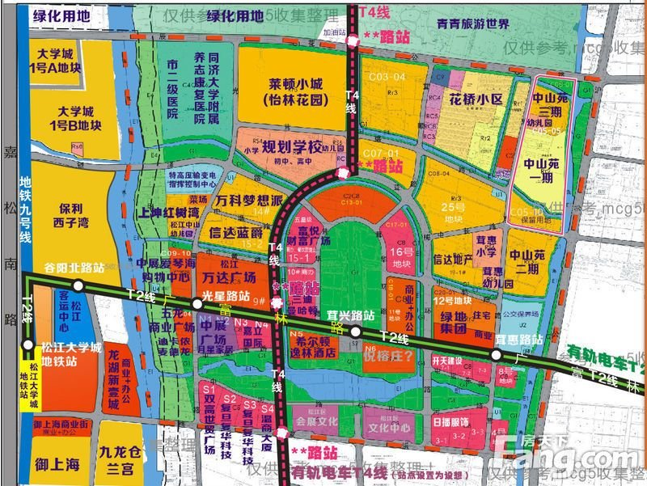
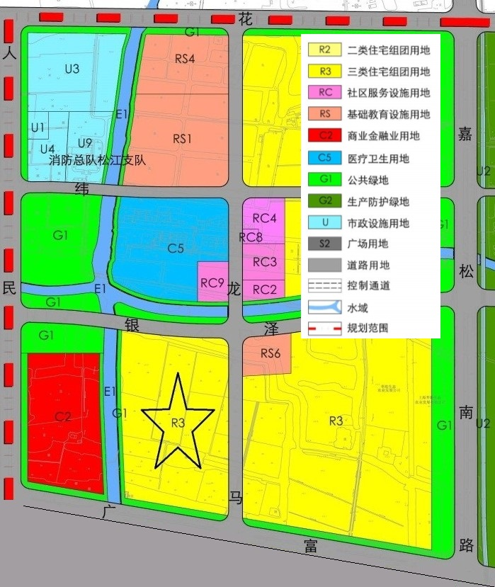

# 松江大学城
本人于2011年入住松江大学城，从那时的荒郊野外到这几年配套快速发展，感觉这个地方整体还是比较宜居的。这几天圣诞元旦，老外放假公司无信，打算详细搬砖加原创讨论一下松江大学城地铁站附近的配套，给有兴趣在这附近置业的同学们一些参考。等我慢慢加文字和图[1]。帖子被一些业主提及，诚惶诚恐，本帖旨在收集信息，大多数信息来源以及荣誉应该归于搜房神贴[2]的楼主soofunid，以及其他安居乐业于松江并贡献给本文的热心朋友们。  
[新房交易量数据](http://data.house.163.com/sh/productrank/week_songjiang_all_all_todayflat_desc_1.html)  
[上海轨道交通俱乐部](http://shanghai.metrofans.cn/forum-352-1.html)  
[松江土地市场](http://www.shtdsc.com/2016/tdjy/dkjs/?type=0&qx=%E6%9D%BE%E6%B1%9F&yt=&mc=&bh=&fs=undefined&zt=&qsjs=&qsje=&jdr=)  
[轨交网友做的12号线方案](http://shanghai.metrofans.cn/thread-376915-1-1.html?_dsign=35f511c3)  
[湖苏沪高铁吧](https://tieba.baidu.com/f?kw=%E6%B9%96%E8%8B%8F%E6%B2%AA%E9%AB%98%E9%93%81&fr=index)  
[茸城论坛](http://bbs.sj.net.cn/)  
[G60上海松江科创走廊](http://g60.songjiang.gov.cn/WebSite/Default.aspx)  
[松江府](http://www.songjiang.gov.cn/)  
[松江信访](http://qxf.sh.gov.cn/310117/reply.setInit.do?page=1)  
茸城民生服务热线37780000（松江的12345)。  
  
图作者：mcg5@fang.com  
[1][原贴](https://www.libaclub.com/t_113_8721825_1.htm)2014年12月29日发于篱笆网，2020年4月23日由于篱笆经营者的无厘头的言论控制，时而无故删帖，因而迁于此处，但是讨论还在原帖继续，所以此处会有对最新消息的一个维护。新来的朋友可以直接看本文，而不是翻阅378页的历史记录耗费过多时间。本文仅是参考，宜居与否是个人主观感受，置业与否需要亲历亲为。  
[2]这里有些信息是来自于搜房网的一个[帖子](http://xiziwanbl.fang.com/bbs/1210348984~-1/31940346_31940346_1.htm)，帖子很长，对未来的期望这里会有一些讨论。手机[倒序](http://m.fang.com/bbs/?c=bbs&a=postinfo&city=sh&sign=1210348984&masterId=31940346&order=desc)在此。  
## 最新消息
### 帖子更新中
333-378 已摘录
### 利好
2021的利好：12号线确定延伸，印象城即将开业，广富林社区医院预备启用，云间，华二增加两个区内高中名额，还有因教育政策导向新分配给松江的市重点高中的名额，对松江整体利好。
### 教育规划
2021 区教育局局长陈小华表示，希望新引入的优质品牌高中与松江原有高中学校交相辉映，形成各具特色、共同发展的新格局。接下来，松江原有6所高中将进行整体改造提升。陈小华透露，松江还将与上师大合作，再办一所优质高中。到“十四五”末，松江将有9所公办高中和3所民办高中，其中有5所市实验性示范性高中、1~2所市特色高中。
2021 世外，爱菊。来源于上半年政府工作报告，进入画饼状态

**那么高中够用了嘛？**
（烟花三月天） 2021年松江中考人数6000多人，到2025年中考人数达到1.2万，现在增加三所高中，多增加高中人数预计1200人左右，高中录取率会逐步下降，按人数比很可能不到40%，所以高中还要不停增加！
### 华二初小
2021年官宣是洞泾的华二初小，公办。
### 华二高中
高中位于G60科创走廊北侧，对于2022年开始中考的孩子们来说是绝好的消息。
2022年预计将招收两个班规模（60人）
### 上外云间  
莱顿南面的教育配套用地。  
2018年4月17日： 莱顿小城南面区域规划有一所九年一贯制学校和一所幼儿园。目前已启动项目前期办理手续，计划2018年底开工建设，2020年9月建成使用。  
2019年4月的消息是今年开工……  
20190912 最近确实已经开工，推土机进场。  
20200320 松江外国语实验学校，幼儿园，小学，初中，高中，和上外松外是一个集团的，2020年9月第一批小学一年级即将招生！！学校还要过2年才能修好，先借读首创附近的学校教室。  
20210504 学校仍在紧张施工中  
20210827 高中也招生了，虽然只有一个班，但是录取分数线仅次于松江二中。
### 沪苏湖高铁
确定要经过松江南站，同时宣布松江南站12台26线的规划  
20191220 月中宣布沪苏湖高铁通过环评，明年开工，预计2年完工。按着节奏是要在2022亚运会前献礼了吧。  
20210504 设计方案似乎要重新定，新的方案比原来风卷云舒的设计更加酷炫，有点科幻朋克的感觉，如果能落实就完美了。  
20210827 听说新枢纽是在2024年8月完工。
### 地铁线延伸
一直没有确定的信息，所以先暂时移除。  
20191220  区委书记：2号线的延长部分规划已经落地，目前是进行规划的深化和推进阶段。产城深度融合体现在12号线的轨道交通的沿站的布点上，让人民满意。同时，9号线运能通过管理进行提升。  
20210504  最近上海交通十四五规划明确提到了推进12号线延伸的规划。  
20210827  官方消息一直是线位确定，基本就是新桥一路过来经过G60科创走廊到洞泾，连接9号线。中间有一段6公里没有设站，民意汹涌，最好是能在洞泾腾讯AI设一站。
### G60科创云廊
又称拉菲尔云廊，位于新桥的北侧。  
20210430  开业的灯光秀很不错，吃饭的地方也还不错，网红打卡景点。以后设施再丰富些可以经常去逛逛。估计未来2021,2022年的电视剧里会有很多出镜。  
20210827  预计明年的电视剧里应该会有这里的场景吧。
### 南部新城规划
首先是很多很多拆迁房， 规划有一个大大的华阳湖，湖北面是科技影都核心区，期待松莱坞蓬勃发展。
陈思诚 -《唐探·番外篇》文商旅项目
新业态的第一步从拍电影开始。在车墩，上影集团与陈思诚主导的北京壹同传奇影视文化有限公司等将首先打造一处留得下的“新中国城”。那些经由顶尖美术、道具、置景等部门还原的“梦想中的世界”，将免于杀青后就拆除的命运，而保留成长久的文商旅项目。据悉，这片“New Chinese Town”将于明年二季度前落成，确保新电影顺利开机。当然，“属于未来”的项目绝不止于内容上的创作。这将是一个创新的运营模式，能满足吃穿住行各方需求，让游客完成时空穿梭的体验。而其中融合电影、沉浸式体验、大型游戏、剧本杀、密室逃脱等多重业态，动用了包括VR、AI等多种高科技手段——一言蔽之，在松江车墩的“唐探”将是一处以电影为基点，激活多重消费的综合性体验乐园。
河南推出的“水下飞天舞”红遍网络，网友们高呼“硬科技”。实际上，让想象成为现实的拍摄地，就在松江的水下摄影基地。
华策的版权业务总部落地科技影都，堪称“关键一子”。该项目将在未来三年达到一亿元以上利润，并会谋求上市。
### 泗泾配套
https://www.songjiang.gov.cn/zmhd/004002/20210621/22715c44-f4bb-4370-976c-083ffa0f7ae4.html
关于《上海市松江区泗泾镇国土空间总体规划（2019-2035）》（草案）的公告
附件提到泗泾地铁站北侧会引入两个完中，1个小学一个幼儿园，还预留了超过七宝万科的商业综合体， 将引入第九人民医院。
### 泗泾第九人民医院
等待消息
### 沪松路快速化
20210504  最近上海交通十四五规划明确提到了推进沪松路快速化的规划。  
### 辰花路高架
还没有具体实施时间，但是从沪松路快速化的设计图纸里可以清楚的看出。当然之前的规划里面都提过这事。  
### 有轨电车
刚刚过去的元旦小长假，开通试运营不满一周的有轨电车2号线成为松江人假日出行的新选择，据统计，小长假三天，有轨电车2号线累计运送乘客54137人次，日均18046人次，其中，12月31日单日最大客流达20314人次。与此同时，有轨电车2号线也成了不少松江人小长假的“打卡点”。T1也即将于2019年8月份开始试运营。  
20191220  应该这段时间T1到新桥在试行了，估计明年初就会开通。  
20210504  之前提过一些城市的有轨电车没有人坐，亏本，影响交通，但是松江肯定落不到这个范畴。至于影响交通，一个是本来老城就拥堵，二是还有未来优化空间。  
### G60文翔路新城出入口
20191220  跨G60的桥已经衔接，预计明年6月正式开通。  
20210504  已经开通好久了，费用节省了，多一个选择，早高峰高速上去拥堵情况少了很多。  
### 周末出行到底是开车还有有轨？
可以微信加“松江新城国际生态商务区”的公众号，点“智能泊车”就可以看到实时的空余车位信息，一般来说周六中饭晚饭前后，周日中饭前后，周日晚饭前车位比较紧张，周日晚饭后一般车位比较空。要在高峰时候出行，建议乘坐有轨电车T2。服务暂停中，正在询问。。。
### 什么人适合居住在这里？
40分钟内上班时间住这里舒适度比较高，最长不要超过一小时。
一小时以上就是折腾，但是看公司氛围，公司环境，工资的份上也是可以忍的。。。我相信也没有人一个月拿着5K,10K天天花3、4个小时上下班吧？ 
作为一个家庭来说，遵循方便一方的原则。所以不管在哪里买房，那就是在房价，房子大小，舒适程度，工作距离，教育，医疗条件寻找一个平衡点。当然我这些都是马后炮了，不过如果有人有意无意进了帖子，我不想因为我个人的感受，让你觉得这里非得是你的一个选择。之前也有网友私信问我可不可以买这里，我如果打听到她或他不是在松江附近上班的，我一般还是推荐去合适的地方买，毕竟浦东还是上海的未来的重中之重，浦西是闹市更加有有海上情调。。。

  
  
  
  
  
## 商业配套
超市比较全，莲花（新城中，老城东），大润发（老城，泗泾），乐购（地中海），家乐福（老城西，新桥），永辉（万达，东鼎，新桥）。开车基本20分钟左右，乘坐有轨电车T2到万达，地中海，东鼎，新理想各商圈也在30分钟内。

### 松江大学城-松江印象城 （预计2021/11/11开业 - 我瞎掰的）  
20200103  地块已经做了围墙，看起来就快要动工了。  
20200310  项目规划地上建筑面积约7.4万平方米，地下建筑面积约8.1万平方米。建筑分为地上四层，地下二层为停车场，规划停车位约1100个，区别于传统百货的布局，松江印象城将不单纯以楼层来分布各类业态，而是将租户组合重新搭配布局，围绕“唯食至上”“零售新语”“智能时代”“次元娱乐”“成长计划”“美好生活”这六大主题来打造，以满足消费者需求。印象城将引进多家首进松江的零售、餐饮、娱乐、亲子及生活配套品牌，其中包含一个4500平米的精品生鲜超市、韩国CJ集团旗舰级双层影城CGV、城市生活主题书店、高品质儿童娱乐教育以及国内外服装服饰、知名餐饮品牌等。  
20200427  地基和地下室基本完成了，疫情耽误了2个月。  
20210504  主体结构已经封顶，估计10月份应该能开业了。  
20210827  最近公布了很多品牌，官宣第四季度见面。一绪，zara。太二酸菜鱼    
20220307  时间过得很快，印象城开业已经有三个月了。业态丰富，地下室一楼的餐饮味道都是很不错的，三楼四楼的正餐也不错，就是周末等待时间略长。住在大学城西侧的业主多了一个晚上夜宵的高质量选择，喝酒以后可以踱步回家啦。
### 三湘四季财富广场    
星巴克，肯德基，必胜客宅急送，永和大王基本涵盖了不愿（不会）做饭的男女青年的晚饭需求。地下一楼是联华超市，有些东西这里买还是比较便宜的。停车费用：半小时免费，3小时内6元，6小时内8元，8小时内10元……20190912 面包新语没有了，新开了老盛昌和另外一家上海点心店。洗手间去年装修了一下，干净不少。
### 三湘四季商业街    
三湘一期和二期之间的步行街，门口有个全家（天然气充值暂停，升级中）。商业街的重餐饮逐步消失中，过去一年开了若干家美容店，早教，瑜伽，24h健身房。。。
### 云清路商业    
有全家，罗森，威尔士，来伊份，喜士多等小超市，其他另有小超市两三家。
### 御上海北面的商业广场  
汉堡王，还有绿地的全球商品直销中心，规模不大，有个类似盒马鲜生的小厨房，可以炒菜加工，也有饭桌，下班来吃点东西也蛮不错的。其他部分和各大同质同类商业设施，一楼吃，二楼早教。
### 松江万达广场
松江大学城地铁站步行至万达需要15~20分钟。周末靠近吃饭的点，车位紧张，部分车位双层但没有启用，大家可以考虑选择附近的商场或者酒店停车。餐厅基本解决需求，望湘园，西贝，曼陀铃，肥猫等等。DQ，哈根达斯，星巴克。服装类有优衣库，GAP，但是没有ZARA，H&M。超市是永辉，生鲜不错。万达投诉电话，4000095066。  
万达车库收费标准：前15分钟免费，15分钟到1小时内凭永辉50元小票免费，否则5元，1小时到3小时不管有没有消费一律5元，第四个小时开始每小时5元。
### 五龙商业广场 
1楼麦德龙，星巴克。  
2楼亲子欢乐区（乐高/舞蹈/英语/轮滑）和海底捞。  
3楼娱乐美食（火锅/餐厅，DFC主题式影厅）。  
麦德龙可以个人通过微信注册，没有年费。停车是1小时内停车免费，购物可以去前台报车牌再多免费一小时，prime会员再加2小时。  
麦德龙南面200米左右有一个麦当劳的drive-thru。
### 中展璞荟/马利来
一楼各种火锅，煲，烧烤，85度c，青岛啤酒。  
二楼各种幼儿培训机构，舞蹈，绘画，金宝贝早教。  
三楼好像是个卖花和宠物创意类的。
### 地中海广场  
离大学城距离稍远，走路大概30分钟，有轨15分钟，开车10分钟。同样周末停车比较紧张。电影院还是不错的。其他各类吃饭的店也都有。
### 东鼎购物中心   
上蔬永辉，万怡酒店，Zoo Coffee，氛围很好。
### 塞纳左岸广场 
1楼有个3000平米的绿地全球商品直销中心，每个月28号是会员折扣日。2楼健身和儿童乐园，3楼台球房， 4楼电影和电玩。还有其他餐饮业。2个小时内停车免费，地下停车场很大，从没停满过。二楼的马丁的早教主要是游泳，乐高，一些小型的幼儿游乐设施。
### 文汇路    
重温大学生活的地方，据说有700多家小店铺和吃饭的餐馆。看着年轻的面孔，来个夏日阳光灿烂，再喝点小酒是不是就仿佛飘回了大学的那个午后？如果大家有空逛逛，可以在大学城地铁站对面的公交车坐18路或者乘坐有轨电车到文汇路站，和大学生一起去逛逛，很有意思，排那么长队就是为了吃个猪手或者吃个饼。周末散步过去走个半个小时到50分钟，吃吃喝喝逛逛，很惬意。
### 文诚路西林北路的嘉禾商务中心   
这里云集各类教育机构，比较有名一点的是金宝贝，据说在松江好多年了，环境确实也不错。这里还有各种舞蹈培训，跆拳道培训，儿童成人的都有。
2021/09/06 看到茸城论坛上有人说这里很多都走了，应该是受到双减政策的打击。就怕是假打击，真跑路。
### 平高商业广场
（9号线松江体育馆站） 盒马鲜生，注意只能支付宝，不能现金，安装盒马鲜生的app，好像是附近3公里下单半小时内送到。在里面请客吃饭也是很新鲜的事啊~就是嘈杂了些。迪卡侬，挺大的，再也不用去闵行或者新桥迪卡侬了。
### 新理想广场  
位于三新路荣乐西路。有家乐福，H&M，一兆韦德，外婆家。大学城过去开车要15~20分钟，有轨25~30分钟。小朋友很爱一楼的小火车，实在是太欢乐。家乐福的价格还是比较厚道的，尤其是进口产品。
### 恒都商业广场 
恒大的小区附近。大润发等。
### 老城-庙前街  
以前没有其他商圈的时候，这里是松江最热闹的地方，当然现在可能也还是，各种小吃小店。脏乱差现象好像改善了一些。
### 老城东-云间新天地  
中山东路249号，也就是二中对面。目前主要是永辉。去方塔园玩可以停车在这里。老城东部的“庙前街”。感觉人气不是很旺，可能是新开没太久的缘故。
### 泗泾-三湘商业广场  
大润发，楼上楼下都有停车场。
### 青浦的山姆会员店    
嘉松南路业锦路口，8公里距离，大学城开过去20分钟，非常方便。注意需要会员卡。
里面的坚果和Costco的类似，相对质量更好一些。京东也有他们的店，但是奇怪的是只有坚果价格比实体店偏贵。
停车位楼上地下都有，楼上比较小，停地下应该会容易些。
推荐大家使用他们的极速达配送服务，1小时送到，非常方便！
推荐购买他们的卓越会员，680一年，购买商品2%的返点一年下来也都回来了，大家可以去店里了解一下。
### 青浦万达茂    
已经开业，去过一次。23公里，开车40分钟，地方很大，作为游乐设施逛逛不错啊。
还有个方法是开车停到吉盛伟邦，然后坐地铁去万达茂。全程大概50分钟吧，这样17号线也坐了。
### 闵行的Costco    
已经开业，朱建路235号，27公里，开车40分钟，由于堵车，1小时也不算长。。。会员卡的预售估计是全世界最便宜的Costco的年卡了。当作娱乐设施，逛逛也不错。。。
### 松江大学城东-绿地缤纷城（空置中）
建设的类似开元地中海广场这样的社区商业。6万平米的大商业包含电影院，超市，运动健身馆等主题商店一应俱全，直接和万达广场做竞争。9万平米的住宅全部是17-18的小高层，住宅区容积率只有1.9，房子沿基地四周分布，中间几乎全部是绿化，再加上南边是3-4F的商业，采光、通风比2.5容积率的梦想派和信达要好不少。 9.5万方住宅，6万方大型商业综合体，紧邻30万方大型中央公园。无栋距围合式双公园、环绕式人车分流。机动车停车位980个，地上283个，地下697个；非机动车停车位地下797个。20190912一直没有开业消息。20191220 绿地各种烂尾，估计负债太高了，还是先不开了，毕竟周围一堆商业。
过去：
2014 绿地：有万达，没居民，我不能开。
2016 绿地：有居民，但是五龙开了，我不能开。
2017 绿地：居民更多了，但是绿地优选开到了御上海，我怎么开。
现在：
2021 绿地：绿地优选御上海关门了，我还是不开。
未来：
2021 绿地：印象城开了，我更不能开。
2023 绿地：金地居民也来了，但是西边的商场也开业了，我还是不能开。
### 松江大学城-大学城站烂尾楼  
20170410 烂尾楼目前已经开始复工，施工许可证显示他的名称叫有轨电车T2线大学城停车场。
20180327 里头楼修起来了，又是松江府衙门最爱的巴洛克式。
20190912 北边地块作何规划，没有定论。
### 松江大学城东-三迪东（待建）  
20171113 楼盘挂出了“盒马鲜生”，“无印良品”的宣传，如果是真的，还是很不错的，这样大学城小区基本都在3公里配送范围内了。
### 绿庭休闲广场（建设中）
20190103这么多年过去了，最近看到那个楼还是没有盖好……是不打算开了吗……
### 新城西-松江智慧港（待拍）
20151216 位于文翔路东胜港路，在昆秀湖南边，各种高大上的设计。就是希望能修起来吧。2017/3/30转眼就是一年多，今年公众号提了几次，似乎不见行动啊，果然一如既往先吹起来。
  
  
  
  
  
  
## 教育配套
### 龙马幼儿园    
绿地蔷薇九里西侧，保利西子湾和绿地的配套。
### 广富林街道公办托儿所
位于三湘
### 松外幼儿园/大学城幼儿园    
龙湖好望山梅家浜路南侧 
### 松外小学        
龙湖好望山梅家浜路南侧。 据说是松江区着力打造的学校。以下是学校的几个相关的链接。
* [学校主页](http://www.sjfls.sjedu.cn/)
* [百度贴吧](https://tieba.baidu.com/f?kw=%E4%B8%8A%E5%A4%96%E6%9D%BE%E5%A4%96&ie=utf-8)

2020学年第二学期八年级区统考  
学校        排名   总分   400分以上人数  
上外松外    1    355.5    41  
东华附小    2    354.4    11  
三新学校    3    351.6    20  
民乐小学    4    350.4    28  
华政附小    5    341.8    10  
松江七中    6      *      9  
  
上外松外最好的班的平均值  
语文 87.94  
道法 26.04  
数学 98.25  
英语 95.86  
物理 97.89  
总分 405.68  
### 松外初中
龙湖好望山梅家浜路南。2016届是从松外小学开始的第一届。2016-2024这是在预初会流失很多去民办的七届。2021年起因为民办要摇号，会逐步减少流失去民办的优质生源人数，当然2025年才知道具体的结果。  
2016：报考人数175人，市重点36人，区重点22人，普高53人，民办高中14人，中专职校43，其他7人。  
2017：重点率35%，普高率89%，平均分546。均分比第二名东华附属高12分，民乐第三。  
2019：松江区公办平均分第一。212位考生,市重点达线率27%，区重点达线率59%，普高达线率87%；与兄弟学校相比我校市重点达线率最高。595分以上的考生达9人。大家再接再厉！！  
2021：700分以上30多个，8个考上四校或其分校，8个上八校加曹二，30多个二中/云间。全校两百多个学生，3成挤进市重点，六成踏进区重点，九成超越普高线。  
      四校八大总共9个，华二1个，交附2个，交附闵行1个，复附1个，华二紫竹1个，七宝2个，建平1个。  
      曹二2个，二中28个，云间6个，一中21个。  
      其他的上大附，市三，南洋，朱家角，文莱有16个。  
### 光星幼儿园
万达西侧，是附近小区如万科，莱顿的配套。
### 上外云间小学
小学和上外松外是一个校长。
2020: 小学一年级招生,学校还要过2年才能修好，先借读首创附近的学校教室。
### 上外云间中学
上外云间中学是一所七年制公办完全中学，办学定位为上海外国语大学附属外国语学校松江分部，高中部办学层次为上海市实验性示范性高中。  
上外云间中学设计办学规模约64个班级，其中，初中每届10个班，高中每届8个班。  
[高中师资介绍](https://mp.weixin.qq.com/s/U_7kaeaqLQx_HfCMbNYEGA)  
初中师资有一大部分是由上外松外带过去的。  
2021：高中招生一个班，录取分数线仅次于松江二中。2022年秋将搬入本校校址。预初4个班。  
### 茸惠幼儿园   
### 茸惠小学       
### 赫德学校（恒大帝景西侧）   
松江区引进的赫德学校是一所以中西融合的双语教育为特色、引入国际化办学理念的全日制民办学校。赫德学校是英国赫德公学（Hurtwood House）的姐妹学校，微信公众号是“上海赫德”。
### 西外外国语    
离大学城也不远，不过这个学校据说收费贵些。
### 华东政法大学附属松江实验学校（华政附属）
应该就是之前的龙腾小学和初中，位于龙源路银泽路口附近（银泽路以北、银龙路以南、银源路以西、龙花路以东），是一所九年一贯制学校，毗邻广富林文化遗址，紧靠松江大学
城。该校办学规模为54个班级，占地面积4.2万平方米，共有7幢建筑物，拥有独立的图书馆和游泳馆。秉着传承与发扬华东政法大学“笃行致知，明德崇法”的校训和“逆境中崛起，
忧患中奋进，辉煌中卓越”的精神，华东政法大学附属松江实验学校将致力于用一流的办学思想培养全面发展的优秀学子。日前，记者前往施工现场，看到附校正在紧锣密鼓地施工
建设中，由于教学场地建设标准较高，建设周期较长，华政附校暂未竣工。记者从相关工作人员了解到，学校预计于2019年上半年完成一期工程。
### 龙腾高中
未建设，规划中
### 绿地云峰幼儿园
### 龙翔幼儿园
佘山珑园
### 九龙仓幼儿园    
### 规划的学校有：
#### 大学城站一号B地块幼儿园    
保利北门大号地块内
#### 2街区09-02地块幼儿园         
首创锦悦北面
#### 龙马小学
未建设，在规划的广富林街道社区医院的北面（龙马路北延伸）
#### 龙马中学
未建设，地点同上，初中加市级示范高中。20180612 上个月看到似乎是在整地了。
#### 莱顿南面的教育配套用地
在商务区万科附近规划的教育用地。上海市松江区教育局 
2018年4月17日： 莱顿小城南面区域规划有一所九年一贯制学校和一所幼儿园。目前已启动项目前期办理手续，计划2018年底开工建设，2020年9月建成使用。
2019年4月的消息是今年开工……
20190912 最近确实已经开工，推土机进场。
20191220 没有消息！
20200320 松江外国语实验学校，幼儿园，小学，初中，高中，和上外松外是一个集团的，2020年9月第一批小学一年级即将招生！！学校还要过2年才能修好，先借读首创附近的学校教室。[公告](http://qxf.sh.gov.cn/310117/reply.setDetailInit.do?id=4B9F665B7303466DB7E1B0C1BA59A2CB)
  
  
  
  
  
  
## 医疗配套

### 第一人民医院松江南院
三甲，个人觉得还OK，平常心吧。
### 松江妇幼保健院
宝宝就在这里出生的，觉得服务还算是不错吧。
20151016 停车场又扩大了些，挺好。
### 松江中心医院
松江的老医院，本地人一般喜欢来这里，不过停车比较麻烦。20160627 听说中心医院想要搬迁，新城方向，但是具体是北部新城还是南部新城就不知道了。
### 闵行儿科医院
小朋友万一有些麻烦，可能需要跑到这里。这里人比较多，可以考虑在网上挂号预约。大学城这里开过去也是很快的，大概半个小时40分钟的样子。沪c一般以前警察也不会管，以后建议大家开车停到12号线终点站，坐地铁过去（也就是两个站）。
### 方松街道社区医院
刚生宝宝的同学需要经常跑的地方，位于泰晤士东侧的文诚路上。各种体检，疫苗，人很多。一般7：30开始拿号，8点开始打疫苗，周四周五相对人要少一些。最近邻居推荐一个“社区580”的app，方松街道小朋友打疫苗可以预约，我觉得蛮好的，大家可以用一下，这样避免起早排队。目前预约好像周二到周六都可以了，特定疫苗不能预约。另外如果需要体检的也是可以一起的，打完针以后去体检一下就可以。
### 新中山街道社区医院
已经启用。
### 待建方塔中医院（三乙）
在新中山街道社区医院东侧，梯形的土地，总面积4w平方米左右。
第一人民医院只算医疗地块大概是18w平方，所以只有最多四分之一个一院南。
看图里面，南部的工业园都会改成绿地，还增加一个半月湖，环境会蛮好的。
https://www.songjiang.gov.cn/zmhd/004002/20210903/6549d0e3-d0e2-40b6-94fe-a09421af92a8.html
### 牙科医院
其实是街道的社区医院，本地人一般叫阔街医院，在醉白池地铁站往北走到阔街，好像也是本地居民喜欢去得地方，价格不贵，但是一天只有50个号，需要提早去排队。
### 医保药店
#### 龙湖好望山的复美药房
终于成为了医保药店，位于龙马路上。周围2公里内还有一家位于新松江路江学路上（余天成东明大药房）。
#### 御上海北面的新开药店
据说也会在今年成为医保药店，因为之前在别的地方已经作为医保药店开了好几年，是新搬过来的比较好申请。
### 规划医院
#### 广富林街道社区医院（待建）
蔷薇九里的西北角的地块边，广富林路北侧人民路东侧。
20180508已经开始征地了。
#### 广富林街道儿科医院（待建）
蔷薇九里的西北角的地块边，广富林路北侧人民路东侧。最近新规划的，待引进。
20180508已经开始征地了。
#### 第六人民医院（传谣中）
20151017 据说位置在广富林路辰塔路西南地块，说是引进第二家三甲，为了松江新城西北部的发展。六院以全国前10的骨科闻名。
  
  
  
  
  
  
## 菜场

### 龙马菜场
三湘四季西侧，4星级菜场
### 钱大妈
确实不错！新鲜便宜。
### 华联超市
这里的价格也比较合适的，关键是近
### 万达永辉
新的低价菜场……东西便宜还很新鲜。现在青菜似乎没有价格优势了。肉类河鲜海鲜还是相对便宜。
### 云清路上的永辉小超市
2019新开的，价格还可以
### 红树湾北角的新型室内农贸市场
2018年动工
### 兴益农贸市场
位于玉树南路上飞航广场斜对面，价格比较便宜，坐公交车过去时间长。
### 东门菜场
在大学城活动的大妈经常听到的一个神秘的地方，那里很热闹，蔬菜水果很便宜。具体位置是环城路204弄，现在东门菜场把原来进菜场的路（西门）封了，由北边进入。说是要进行综合整治，导致的结果是菜场生意差些，人少，价格也高了。
  
  
  
  
  
  
## 文化类设施

### 广富林街道社区文体活动中心（筹备中）
绿地蔷薇九里北面（规划）
20220307  近期消息是作为2022五大新城松江新城的2个公共项目之一对外招标。细节待补充。
### 新城图书馆
松江地中海附近， 人民北路的图书馆，还不错当然书不会太多，公交9路经过。坐有轨两个站再走一小段。我一般直接走过去，30分钟。
### 老城的新图书馆和剧院
还没有建设好，我很向往齐全的图书馆和文化场所，最新的规划是在老城醉白池对面。好在坐地铁过去是三个站，也还可以吧。一直没有开工……
20210906 大概样子好像有了，希望可以早日完工。
### [区职工综合活动中心](https://mp.weixin.qq.com/s/xE9y9MqGRI2ypeLpsPeyiQ)
大学城中山街道，在商务区的湖的附近，茸兴路梅家浜路口北侧。
预计2021年7月投入使用，外形从上往下看，大概就是一个Mickey Mouse。。。
A馆或主馆以后是职工综合活动中心。西侧的B馆以后是可容纳463人的多功能报告厅，东侧C馆将作为松江规划馆和G60科创走廊展示馆。主馆建筑为5层，东、西两馆各3层。
项目规划内，还将配套健身步道，以及设置于“三碗”建筑西侧的篮球场、羽毛球场等运动场地，在活动中心地下一层，还将设置拥有286个车位的地下停车场。
### 书店
泰晤士的钟书阁
万达对面的钟书阁
山脚下的书店
  
  
  
  
  
  
## 公共服务

### 广富林街道派出所
位于龙湖好望山的东南角靠近菜场的位置。方松街道派出所已经转到这里来临时办公了，原来的地方重新装修，不知道以后是不是留下的人就是广富林街道了，然后回迁方松的就ok。
### 广富林社区街道的办事中心 
在首创的对面，人民北路3456号，可办理居住证，社保卡，医保，劳保，计生，残联，社会救助，住房保障，档案等各项业务。临时居住证仍在广富林路1096号办理。咨询电话：37655605
### 广富林办理医保办事处    
在保利西子湾南门
### 广富林街道社区文体活动中心    
绿地蔷薇九里北面（规划）
### 此前的规划（待更新）
#### 文翔路衔接G60已经批复
将增加上下匝道和收费站，个人觉得影响不大，大学城去上海市区方向相对会更快一些。原本走到这里是地面3.5公里，高速4.5公里，以后就是地面4.5公里。可见如果地面车速达到高速的20%的速度，那么就会节省大概1~2分钟……会不会节省高速费用就不知道了，也许节省2元。201906：现在的评估是可以缓解嘉松南路入口高峰时间的拥堵，节省的时间可能在10-30分钟都有可能。。。
#### 大学城广富林街道龙马路附近的规划
下图来源于拍地的里面文档的规划图片，银泽路附近基本就是街道办事，社区医院，商业金融，教育的集中地，甚至还有块不小的绿地。住宅加上即将拍的地还有两块，人民北路西侧实际也有一块地，不知道是不是也是住宅性质。
U3 就是移动; U1 街道综治中心; U4环卫设施; U9消防总队 （南面G1绿地增加110KV变电站）
RS4 35班小学; RS1 54班完全中学（初中+高中），RS1东边的住宅用地规划了公厕/垃圾收集站/卫生卫生站。
C5 400床综合医院； RC9 社区医院； RC9上面增加一小块为社区养老 （图上没有标）
R3五角星就是之前的地王，R3是绿地蔷薇九里，北边两块黄色地块还是空地。br tag

  
  
  
  
  
  
  
## 公园和休闲场所
### 百花港休闲林地
20220307  位于辰花路嘉松公路东北角，占地面积很大。年前已经大致成型，估计就要在这个春天绽放。由于没有停车位，建议大家骑自行车或散步前往。
### 附近适合亲子散步，遛狗的小径
通波塘西侧：保利西子湾东-》龙湖新壹城东-》上马路往南切换到下一个小区-》一直能通到松江新城附近，就是灯光啥的没有，晚上去那里就是作案现场，白天嘛也比较凑活吧，因为总体感官不是太好。
张家浜南北侧：除星辰园，从上外松外往西通到大学城，中间有两个出口，龙腾路和龙源路。南北两侧河岸都是通的，也是没有灯，但是白天感官不错，比较舒服，尤其是快到龙源路的那个荷花池。希望以后可以继续向西延申，直通三新北路甚至辰塔路。
### 松江新城中央公园    
松江新城中间一条长长的绿化带，从嘉松南路贯穿到最西边的泰晤士小镇。天气适宜时，散步，遛狗，带孩子真是舒服极了。
### 东华大学   
绿化很好，人也不多，东华大学还是改名字叫回中国纺织大学为好……
### 泰晤士小镇   
拍人物照的好地方，比较青睐里面的钟书阁。
### 佘山    
周末骑车，跑步，爬山很不错的地点，就是人多……晴朗的时候，东面隐隐约约可以看见上海中心。可以先上东佘山，下来再爬西佘山。
### 商务区的五龙湖   
希望以后可以达到像中央公园的效果。湖南部的基本形状2015年春节前已经挖好了，好像没想象的大，可能是没灌水的原因。月星家具后边的一块公园算是最早完工，旋转的红色舞龙桥在夜晚灯光下，拍照效果不错。桥面用的是玻璃，所以雨雪天气时要注意桥面会比较湿滑。虽然东西不多，散步也挺不错的。晚上会有人在靠近林肯的那一头跳广场舞，还有唱沪剧的。小孩子会在几个水坑的小破跑来跑去，也还行，就是那几个坑太坑了，水不流通很邋遢，无脑设计。停车不方便，车位很少，只能路边临时停停。或者停五龙广场再走过去。
### 醉白池   
这都是松江最有名的古建筑群，醉白池门票才12元。据说桂林公园是黄金荣效仿醉白池而修建的。
### 方塔园    
建筑大师冯纪忠修建的，规划以方塔为主体，保存邻近的明代大型砖雕照壁、宋代石桥和七株古树；从园外迁建明代楠木厅、湖石五老峰和美女峰、假山、清代天妃宫大殿；方塔园的古文化风采，不仅吸引了众多访古觅幽的游人，还吸引了许多拍摄历史题材的影视工作者，《西厢记》、《牡丹亭》、《窦娥冤》、《聊斋》、《封神榜》、《济公》、《杨乃武与小白菜》、《祝枝山传奇》等10多部影视剧都曾在园中取景。
### 天马山公园      
天马山有99.8米高，走上去还是挺累人的。上面的斜塔确实角度很大，据说世界第一，但是因为高度并不高所以名气不大。总的来说，不是太值10元的票价，应该像佘山一样，免费对外开放为好。同时发展附近商业设施，停车场。修点别墅，豪宅，对当地是很好的一个发展啊，相当于再造一个佘山。不知道规划的东西何时可以实现。
### 小昆山公园      
小昆山东西残存不多，陆机名气太大。
### 广富林文化遗址公园    
20180626  广富林文化遗址公园一期开始试运营。考古几十年了，才转成建设博物馆，真是煞费苦心。音乐喷泉也是很不错的，湖的东南角开了一个黑渡口的茶馆，有些茶艺表演什么的。湖北面的希尔顿酒店也在修建中。文化展示区包括道教文化展示馆——尧舜禹纪念馆、佛教文化展示馆——知也禅寺、宗教艺术馆——富林塔等建筑在内的宗教文化建筑群，西南角的文昌阁、城隍庙、关帝庙，形成一东一西两个宗教文化区域。此外，遗址公园内有20多个各类主题展示馆、纪念馆、陈列馆等，包括陈子龙纪念馆、考古遗址博物馆、富林瓷窑展示馆等。广富林湖底人防车库占地面积约4万平方米，车位逾800个，共3个出入口，分别在龙源路、银泽路和园内民俗文化展示区附近，每个出入口各有2条车道。现在有年卡了，价格还行，相当于去四次赚回票价。  
20210504  公众号宣布了从6月1日开始公共区域免费，只有场馆收费。倾听民众呼声，真的是不错。当然也有可能是因为酒店陆续开放，被迫也要作出一些改变。之前办的年卡如何退费还没交代，哈哈。  
20210901  免费以后，偶尔开车进去逛逛，生活很美好。夏天时候的晚霞真的很美，不知道朝霞能不能看到，因为虽然免费，但是还不是24小时开放。
### 欢乐谷  
要是没去过，可以考虑办张欢乐谷年卡，第一年贵些是498，第二年开始续卡是365。周末天气好与不好都可以去欢乐谷玩半天，真的是蛮欢乐的，停车费是一小时6元。比起外面各种设施，这个价格算是有点竞争力了吧，只是欢乐谷的节目不创新这个是有点遗憾，这么多年了，几个现场表演还是上海滩，满江红，水晶博士。两岁半的小朋友应该可以玩一部分设施了。
### 玛雅水乐园  
夏天才能玩，去过一次，玩的很high，小朋友再大些可以去疯，不过要注意防晒。 2016年的夏天开了二期。
### 深坑酒店    
已经开业，很有特色的酒店，算是松江的地标……价格不便宜，打卡可以去酒店外的乐园，门票正价120+10元鞋套费。  
### 蓝精灵乐园 + 深坑秘境
就在深坑酒店旁边，以前蓝精灵乐园开业的时候我一直认为很小的地方，直到最近去了一次，才发现地方还挺大的，值得一去。  
20210504  门口工作人员介绍说六月份还要再开一个水世界，大概15000平方米，可以到时候再看看。  
### 青青旅游世界    
好吧，我一次没去过，鉴于它在附近……这个地方实在是被浪费了，搞得不成功，应该重新规划或者开放做公园得了。  
### 月湖公园   
所有去过的公园里面，靠建筑物和布景能够吸引我的这个算是第一了。另外，长长的沙滩，戏水池，爬行网，跳跳云这就是亲子乐园的天堂。缺点是门票比较贵，120一个人，儿童50，宠物30，玩一天6个小时，车要36。每年的秋天的时候，上海穷游节的时候半价。现在有年卡，360一家两大两小一年，算是很便宜了。里面食物和水价格很贵，最好自己带齐了去。每个小朋友的景点可以玩1个小时，4个小时就没了，午饭一小时，休息一小时，基本就好回家了。地图看着不是很大，问题是前面四个景点玩疯了，你都没力气去走后面三分之二的地方……
### 松江老城仓桥    
在松汇西路，是一个江南水乡的样子，还在努力把这里的老居民搬走，已经搬迁的商铺居民楼都用水泥封门。过上十几年应该是一个漂亮的水乡一条街吧。在路头上中心医院对面，是修旧的公共公园起点，终点应该是西边“水云间”联排的云间第一桥。20151016 新闻里面说住户签约的消息。看来过几年就可以实现水乡老街。
### 云间粮仓
地方不错，几家西餐挺好，还有小型剧院和一个游泳馆，当然还有其他的攀岩，篮球的运动场所。
### 辰山植物园    
不错的地方，一年都要最少去一两次。带孩子拍拍照，春游秋游绝好的地方。
### 樱花园    
位于辰山植物园附近，2013年种的树，规模很大，不过在高压线下面，去玩的时候注意别带风筝……这几年估计花开的不会太好。  
20210504  今年春天樱花终于开起来了，感觉还不错，虽然高压线有点烦人，但毕竟是免费的不是。高压线有没有辐射我不知道，但是一定能杀毒啊。  
### 松南郊野公园    
规划很大，配套很差。位于黄浦江北侧。草坪几乎没有，不建议去这里扎营什么的，停车以后跑跑步还凑合吧。
### 广富林郊野公园    
在辰花路以北沈砖路以南龙源路以西辰山植物园以东，与广富林遗址公园隔河相望，区域面积4.6平方公里，作为上海“6+1”试点郊野公园之一，将着力于集聚游憩功能、彰显郊野特色、优化空间结构、提升环境品质。
### 昆秀湖（建设中）   
位于文翔路辰塔路西侧，有大片樱花，梅花，海棠，另外还有几个巨大的沉积木化石。非常适合春天秋天带孩子来这里放风筝 （要远离高压线），需要注意的是车开慢一些，这里岔路多，出过好几次土方车和小车，电动车的事故。20160627 今年春天去，不大方便停车，希望能在附近规划一个停车场，或者周末开放工业园的停车场。收5元就好了嘛。
### 纳米魔幻城（建设中）    
还没营业，最近说什么冰雪大世界要入驻。地方不那么大，放了些恐龙呀蘑菇房子啊，不用特意去，觉得是卖房子的配套。不过经过可以去看看，到点或者人多的时候保安会打开旋转木马和火车，可以免费坐。
20151116  上次骑车看到商业部分的外形基本出来了，在修补外部的环境，草皮河道什么的，推销的人在万达搞过一次，据说前两年的联体别墅价格涨了不少（可惜是40年，又偏），感觉只适合租给游客。  
20181231  还是没有修好。。。  
20210504  破破烂烂的地方。。。  
### 天马郊野湿地公园（规划中）   
位于佘山镇西部片区的天马郊野湿地公园，目前在规划中。
  
  
  
  
  
  
## 比较远一点的景点

### 朱家角    
水乡，停车不太方便，距离相对于其他水乡要近，可以来看看。江南水乡大致如是，规模不同。这个算是mini的。感觉还是周庄更完整些。
### 东方绿舟    
地图也看得出超级大，在里面步行会很累吧。我没去过，只是去过附近的水上运动场，在那里划过一次龙舟比赛，蛮high的。看着体校的学生被太阳晒得黑黑的，真是自己小朋友把游泳当爱好学学就算了吧……这附近很多农家乐，不过也不便宜，倒是挺新鲜的。
### 报国寺    
淀山湖边上，淀山湖一村。这寺庙来头不清楚，我到过村边上的水泥船上吹吹湖风，感觉特别凉爽。
### 太阳岛    
唯一一次是去搞公司部门活动，2006年，感觉地方虽然大，但是比较粗糙。2021年本想去看看，结果看到不好的评论就作罢了。
### 淀山湖    
湖面宽广，是西湖的11.5倍，可是却不知道怎么去玩耍……
### 闵行体育公园   
提这里主要原因是为了拍牌……当然公园本身也还是不错的。
2021年去了两次打疫苗，春天时候樱花落下来还是很美的。就是靠近外环噪音还是有一点，马上也要抬高成高架了。
### 青西郊野公园 
2016年10月开放，大学城开过去在一个小时出头。
### 青浦博物馆    
总的来说应该不算大，上层有各种瓷器，下层是个古码头，上书青龙镇。大概是南宋时候设立了对外贸易的港口。
### 青浦崧泽文化博物馆     
上海最早的人类文化遗址，6000年前，看到有一些原始社会的墓葬还原。还有各种随葬品，有些看上去还算是要花费功夫打制的，比如玉。
### 上海迪士尼    
非周末，避免高峰走G60-G15-S32-S2，S2立刻就有岔口去迪士尼西入口，全程70分钟。非高峰时段，晚上8点走外环是最快的，60分钟就能到了。如果是周末，早上开车走G60外环去康新公路站停车大概60分钟，然后坐一站地铁到迪斯尼，停车费20，来回地铁费12元（两大一小），也很方便。另外中午12点后停车只要50元，也可以去outlet停车，购物抵扣部分停车费，去迪士尼玩可以坐公交很快就能到。吃饭建议出园，从和迪斯尼小镇相通的门进出，选择多一些，稍微便宜的选择也有。
### 嘉定图书馆    
根据地图，是在40公里左右，开车估计一小时。去过之后觉得网红不能信。装修尚可，就是规模很小，没有网文描述的大气。。。
### 青浦乐高乐园（待建）   
上海乐高主题乐园将选址淀山湖畔，预计2020年动工，2022年完工。选址时在东方绿舟站周边地块。
### 得丘
靠近莘庄的艺术工业园区，里面有mini古堡，咖啡馆很有意境。还有到处乱跑的大白鹅，挺有意思。
  
  
  
  
  
  
## 运动设施

### 龙湖wills 威尔士健身会所   
龙湖好望山下，装修中，希望没有跑路。。。目前是说6月底装修完成，重新开业。
2021 开了，延续了几个月卡。
### 松江大学城游泳馆    
性价比可以，记得以前夏天去，300块钱15次
### 松江大学城滑冰馆（真冰）    
挺好玩的，玩过一次，有很专业的小朋友在空中飞……
20210715 终于我的孩子也能去玩了，呵呵。小朋友大概算上鞋啊手套啊，35一个人。要在公众号“上海大学生体育中心”预约，这段时间是每天1-3点，6-8点。
### 网球场    
若干，外国语大学，东华大学，人不多。
### 爱好跑步的     
安全一点：建议路线是三湘四季小区里面四期的湖，东华大学里面湖及周围教学楼，外国语大学里面的标准操场
### 爱好骑车的    
路线1：人民北路 - 佘山 - 辰山植物园 - 广富林遗址 - 泰晤士小镇 - 松江中央公园 - 茸兴路 - 广富林路 - 万达 - 回家。  路线2：朱家角方向 路线3： 周庄  路线4： 淀山湖环湖
其他相对较远的“商业配套”
### 青浦奥特莱斯    
25分钟车程，一年大概去三四次吧，停车比较麻烦，有的时候我直接停吉盛伟邦走过来更方便些。价格比城里的商场肯定会便宜些。号称现在月营业额三亿。而且听说不少浙江江苏的会开车来这里买衣服
### 青浦米格天地   
路面拓宽了，实测大噶需要21分钟车程，配套比较全有电影院，地下停车场暴大，大家可以把车听这里去奥特莱斯也是很方便的，不过很容易找不到停车位，所以记清楚最好。吃饭的地方在电影院一起，蛮多的，价格中等吧，比奥特莱斯选择多一些。
  
  
  
  
  
  
## 家具，装修

### 月星家居
万达对面
### 好饰家   
松江的老牌购买装修材料的地方了，荣乐中路上。装修的瓷砖啊榻榻米啊橱柜啊都是这边定的，价格和市区差不多吧，大家也多多支持本地商家。当然如果价格差很多该选啥就选啥。
### 金盛国际家居  
后来开的店，中山东路上，基本一些品牌都有了，很多和好饰家的店其实是一个老板。
### 同福易家丽    
新开的，松卫北路靠近G60的店，品牌也都有就是人气不足。不过也意味着活动会多一些。
### 青浦吉盛伟邦    
25分钟车程，卖家具的地方，巨大无比。大多数有名的品牌这里都有了，至于价格我没有仔细比较过，也是看着舒服价格合适就拿下了。年末的时候会有一些促销，反倒五一十一时候千万别去，那时候价格可能还更高些。
### 松卫北路五金市场    
这里蛮大的，估计装修需要的一些零件可以这里搞定
### 宜家    
楼主之前一直开车去浦东那个ikea，也就是四五十分钟的事。
  
  
  
  
  
  
## 酒店

### 万达的配套酒店    
好像是准五星级，一晚上400。没研究过，不过这个价格是3星级的。
### 富悦大酒店   
建筑面积17.5万平米，酒店面积达10.5万平米。大堂面积达2000平米，层高11米。整个酒店包含三栋大楼，共拥有各类豪华客房1000间，且每个客房都安装了24小时新风系统、落地大玻璃窗户，装修风格时尚。酒店配有两个超大多功能厅，面积分别为2300平米和2000平米，内设舞台，配有专业音响、灯光等。拥有中餐厅包厢45个、自助餐厅等。还有10多个不同规格的中小会议室。共配有1500个车位，可谓目前上海地区规模最大、设施最完善的酒店之一。
### 三迪华美达酒店    
造型还比较不错。刚开业，看评论都是抱怨设施不齐全这些内容……
### 凯悦酒店  
也是三迪的，20161017刚刚开建
### 希尔顿酒店     
这里这个是广富林遗址公园北侧的希尔顿酒店，建设中。  
20170330 有望今年完工开业。  
20210827 已经开业
### 广富林宰相府酒店
20210827 已经开业, 大堂是夏言故居
### 其他酒店    
各类酒店、餐饮配套设施也将逐步建成，位于古镇改造区的院墅酒店正在施工。
### 深坑公园酒店    
超五星酒店，第十七层在水下，落地窗玻璃外面是海洋生物。深坑还是有些特色的。进酒店，需要在酒店消费才可以，要有预定号才能开车进入。吃自助，不能到坑里去玩，只能在地面看看这个人工大洞。
### 生态商务区6号地块，11号地块  
也是三迪新拍下的地，不知道具体规划是什么，应该也是酒店和商业体。
### 上海海华侨城欢乐谷嘉途酒店  
2017年底开业，四星级。20180718酒店开业。
  
  
  
  
  
  
## 交通

### 九号线    
九号线就是松江的生命线，大多数白领还是原因坐地铁通勤，虽然时间长一些，但是不累好过开车，价格合适好过开车。我们管居住在松江，工作在张江的上班一族叫两江总督，这个头衔可不是一般的大呀。泗泾的拆迁房和经适房马上就要交付了，我一算，乖乖，至少5、6w人，松江再不努力搞条新的地铁线路，以后地铁出行天天限行的节奏。20161216最近新闻可多了，各种跳站，车门无法关闭出问题（还是不是人多引起的），好了，3年下来，上海最多人流——9号线，松江往徐家汇方向，排名第一。拆迁那么多人去松江难道预料不到？
### 包车模式的通勤：飞路巴士(微信号搜索deerbus)
从松江大学城到张江的，好像也很不错，价格便宜点，而且可以提前退票。现有飞路路线是张江到松江，主要站点如下，实际到张江可能会晚到10分钟。20180530 微信公众号有问题，需要下载app可以找到的9号班车线。
莱顿北门6：55  松江大学城地铁站7：03 新城地铁站7：10 张江地铁站8：37 半岛科技园8：45
还有一条路线是松江新城到临空。如果不是去张江上班，去其他地方，比如漕河泾，紫竹等等也可以发起新路线，当人凑够了就可以开新的路线了，非常好的方式，也可以缓解交通用途，绿色出行。
### 有轨公交   
到万达，地中海，泰晤士更加便捷。住在万科，信达，莱顿的人去地铁站也更加方便了。
### 自驾
松江离上海城区比较远，所以很有必要谈谈自驾的问题。
* G60	在大学城这里过去，我一般走广富林路，一路向东，穿过G60，荣乐东路，在新桥上G60，可以便宜5块钱，比新城G60上去稍微慢一些，但是时间差不了多少毕竟路程变短了。文翔路衔接G60将增加上下匝道和收费站，那么以后大学城去上海市区方向相对会更快一些
* G15	借道去S32什么还是很好用，比较快。
* S32	S32是去浦东机场的一条比较快捷的路径，当然出上海我有时候也走这条路，毕竟路宽车少，比G60省心多了。
* G50	G50需要到青浦的赵巷上去，以前去虹桥一般走这里。
* 嘉闵高架	新修好的高架，以后应该是走g60-嘉闵高架去虹桥，应该是时间最短的路。我走了一次：大学城-》新桥高速-》虹桥，35分钟搞定！20151113 （转）嘉闵高架 南二期已经于10.28开通，莘庄下来方便不少。下来是莘福路，可以掉头上高架去虹桥枢纽，直行是莘松路，晚上下了莘松路大概22分钟到莱顿！20160410 到莘松路的下口也开通，所以去闵行体育公园可以这么走：卖新公路去新桥，转明中路，转莘松路，嘉闵高架上去就下来到顾戴路。以后去闵行儿童医院，可以把车停在12号线七莘路的商业设施停车场，转12号线去顾戴路地铁站（儿童医院北门）。
### 路程时间
* 松江到老闵行、紫竹科学园 G60-G15-S32，价格20，时间很短，不堵车的时候，大概20分钟的高速，20分钟的地面。
* 松江到张江	地铁过去一般要一个小时四十分钟，开车我估计不堵在1小时左右，看时间点。
* 松江到漕河泾（闵行）	一般都是地铁过去，大概40分钟的样子（包含走路）。
* 松江到漕河泾（松江）	开车应该比较快，30分钟应该能到吧？
### 路过松江大学城地铁站的公司班车：
#### Schlumberger
早上7点，好像是去青浦方向
#### Intel
早上7：10，去老闵行紫竹，全高速，一般8:10分到公司
#### 蒂森克虏伯
应该是去佘山，具体时间不清楚
#### 富士康
早上7：08
  
  
  
  
  
  
## 近期规划

### G60沪昆高速莘砖公路新建匝道
市路政局回复的，表明该匝道的规划是有的，而且是一对上下匝道，已经批复。 
但具体位置在中心路还是莘砖公路还没有确定。预计2-3年也就是2020年前修好，此后松江大学城进城可以走这条路上g60免高速费，而且和走松江新城上g60进城的时间是几乎一样的。20171220之前忘记更新了，发改委已经同意了。
### G60 松江段抬高
2015年要开建的项目，可以缓解新老城间交通的问题 20170330 转眼又是2年，也许2020年前会实施。20171220 一直推到今年，貌似要后面两年推进了。新老城区即将连成一片。
### 铁路松江南站枢纽
各种迹象表明，沪苏湖铁路等，会诞生新的松江南站，此处可以通勤到虹桥，上海南，上海东，嘉定，青浦，杭州，湖州。因为此等原因，也会有促进更多的公共交通路线接入。希望松江zf给力点。20171220 最近官方消息都出来了，松江南站规划12台26线，比上海东站10台22线还要大，会是西南进入上海的重要枢纽。另外原来的松江站也会合并到南站，松江老城区又释放了很多土地。20190910等待今年的具体规划中。
### 嘉松路延伸到松江南站
大工程，估计一时半会拆迁什么的没这么快，2020完工就很好了。20171220 也是说后面推进，都是配合松江南站扩建的大工程。
### G60松江东西出入口
配合前面的G60抬高，真心不希望取消嘉松路的口，因为还是很方便周围邻居的。20190910 东出入口施工进行时，几个柱子起来了。
  
  
  
  
  
  
## 远期规划

### G60松江段免费
这个是区委书记某一年提的，当然十年前也有人提，总比不提好吧？
### 松江快速路
2016-2040规划草案提及，范围是北面辰花卖新，东沪松，西辰塔，南s32。主干道是嘉松南路和g60抬高后的地面公路。20190910最近文件有提到，已经招标做规划了。
  
  
  
  
  
  
## 产业园（工作机会）

### 各种厂
我所知道的，广达（松江的纳税大户），富士康，各种苹果供应商，巨人（游戏），toto，绿箭，重联，奔腾（飞利浦），还是更偏向低劳动力成本的工厂类居多。松江需要尽快的调整产业，要不然上海的人力成本的逐年升高自然会导致这些纳税大户的西移（重庆）。20170705 论坛上看到的一些内容：“松江区产业结构调整，五年内工业区工厂都要搬到江浙去。日清搬到平湖去，不去的员工都有赔偿的。化工厂全部搬走，管你是不是纳税大户。”
### 裘比影视城
2015新规划，在松江西部位置，围墙一大圈，估计是在影视特效方面的产业链，挺好，高科技，无污染！最近又在吹什么国际导演签约虾米虾米的，小区有个人是这家公司的，倒是说是要建起来的。
### 临港科技园松江园
目前规划为9.64平方公里，据说北扩很多变成了一个巨大科技园，如果以后12号线通车到洞泾，那么大学城的兄弟姐妹们有福了，去这里上班，最多5个站，30分钟到家。不过领导可能对你说：你可以多加班2小时再回家。
### 漕河泾松江园南部综合体项目规划
又名[拉斐尔云廊](http://www.caohejing.com.cn/portal/index.aspx)，临港科技园松江园。
高大上，总建筑面积86万平方米，最底层是道路、人行通道、停车场；围绕着这条主轴线，26幢80米高的建筑，在两侧呈点状式和板式分布。地面1至3层，采用庭院式的建
筑风格，用游廊、咖吧、喷泉、空中绿化等将所有建筑连成一体；在每栋楼的屋顶，都规划有屋顶花园，最顶部再由一个装有太阳能发电板的整体顶盖覆盖，从远处看就像
一条巨大的建筑长廊。在1.5公里长的长廊两侧，还将配备大面积的公共绿地。东西两侧包括一个湿地公园，以及一个由园区落户企业淘米网打造的文化主题公园。
20161009地基已经打好，工程如火如荼的进行中。
### 佘山文化绿洲
最近开始提的一个文化产业园，在佘山北边的泗陈公路上。看着设计是蛮好的，希望做的好看点，周末上班族不在的时候可以吸引旅游的人群，拍照啊，吃饭啊拍电视剧……。主页： http://www.lingangwh.com/ 20170705最近有新闻提到开了一个三联书店，山边上的书店。有地方提到签约400家业态，也不知道真假，因为完全搜索不到……
### 飞商网将在上海松江建全球最大飞机、航材销售展示中心
这个是2016年的新闻，感觉是不错的，利于松江产业发展。注意时销售展示中心，不会有噪音污染才对。
### 虹桥商务区
松江大学城出发，九号线到松江南，坐火车到达虹桥火车站大概40分钟。当然开车走嘉闵高架也是很方便的。//核心区内352栋楼宇的建设将基本完成，入驻企业有望超过1000家。 到“十三五”末，虹桥商务区常住人口约50万人，总就业岗位达65万左右。
### 青浦华为
2017年6月1日，上海市与华为投资控股有限公司在沪签署战略合作框架协议。双方将以此次战略合作框架协议签署为契机，在软件和信息服务业、物联网、车联网、工业互联网、智慧城市等领域加强技术研发、示范应用、融合创新等方面展开合作，促进上海信息产业创新发展和智慧城市建设应用。按照此前的选址，应该地点位于西岑，开车路线到大学城大概35公里，50分钟车程。
### 海尔产城创
上海市与海尔集团6月29日在沪签署战略合作框架协议。海尔集团规划在上海松江区投资建设上海区域总部暨“产城创”上海基地，以工业互联网平台为核心，积极发展“产城创”生态圈模式，全力打造集物联网、移动互联网、电子商务、软件开发等智能制造、智慧生活、“双创”于一体的开放型服务平台，加快推动“上海制造”迈向“上海创造”，为上海打造国家级工业互联网创新发展示范城市和全球先进“智造”高地、巩固提升实体经济能级以及加快建设具有全球影响力的科技创新中心提供有力支撑。
### 修生药业
20170710国际一流、国内领先的中国医药行业龙头企业修正集团，投资100亿元在G60科创走廊建设修正集团上海高科技生物制药产业基地。根据松江区与修正药业签署的框架协议，修正药业将在松江兴建现代生物制药领域最具代表性的标杆项目，在松江的投资包括总部大厦以及营销结算中心和高科技生物医药产业园。
### 中国版“星链计划”
全球多媒体卫星互联网项目自落户松江以来，项目建设进展顺利。
2021年4月22日，我国首家国资委卫星企业中国卫星网络集团正式成立，其注册资本高达100亿元人民币。在对中国卫星网络集团的相关介绍中人们发现，其经营范围不仅有卫星开发、设计和发射等常规卫星业务，更是扩展到了基础电信、卫星通信、广播、导航等各种的服务层面中来，作为增值业务进行经营。换句话说，网络卫星集团的主要目的就是将卫星发射升空后使其完全服务于人民日常生活中。
https://www.songjiang.gov.cn/xwzx/001001/20210805/90a64511-4d91-461f-915b-dac54e176cf5.html
  
  
  
  
  
  
## 附近度假休闲

### 杭州
对杭州比较有感情。来上海觉得没大山爬实在少了点乐趣。好在松江大学城出发，地铁到松江南站高铁站，换高铁或动车，再换杭州地铁到西湖边也就一个小时到一个半小时，话说住杭州的同学们一年恐怕也就是去西湖边逛个四五次吧，那我就多花点金钱成本咯。开车也试过，不过觉得太麻烦了，还有平时限牌不是很方便。我的帖子：我所知道的杭州（https://www.libaclub.com/t_7343_10127809_1.htm）
### 周庄
大学城开车过去，不走高速90分钟。可以选择周五晚上出发，到周庄吃好饭，超市采购好零食，然后进周庄（没有门票费用）。选择住里面的酒店，可以在里面休息一天或者两天，然后周六晚或者周日白天回来。慢慢悠悠的，拍照，画画，听听歌，感觉自己是文艺青年啊。另外午夜时分出去逛也很有意思，特别像国产谍战片，还有一个酒吧半夜在里面轰鸣，也挺有感觉的。路上经过大观园，意思不大，不推荐进去看了除非是红学爱好者。路过大观园附近的“梅园”，在旁边的餐馆吃饭可以免费进去看看，6月的时候有成片薰衣草，蛮不错的地方，度假村弄起来可能比较有禅意。
### 乌镇   
若干年前去过好几次，最近没有去过，以后去了再说吧。也是很近的地方，和周庄也是差不多。
### 苏州    
开车过去2-3小时，原因是路上去了阳澄湖。当时宝宝还小，逛得不够尽兴。金鸡湖那个堤感觉不错，还有平江街印象蛮好！
### 宁波    
还没付诸行动过，不过应该不错，人少，还可以去舟山逛逛
### 济州岛   
出国旅行，还有比这更方便的地方吗？90分钟就飞到了还不要签证，就是租车必须要国际驾照不太方便。另外，韩国没啥好吃的什么黑猪肉活章鱼的……那个火山一定要去爬爬。
### 南京    
高铁松江南过去90分钟左右，南京地铁现在也是比较方便的，玄武湖比起8年前环境好多了。
### 千岛湖  
高铁已经开通
### 黄山  
高铁已经开通
  
  
  
  
  
  
## 各种不利好消息和近况

### 雾霾
这个是2014开始的引起大家注意，并且一年比一年严重的，十三五规划号称要解决这个问题，期盼蓝天。2016年以后雾霾天数和严重度都下降了，当然还是要持续改善。
### 飞机噪音 
因为虹桥的飞机航道管制，松江大学城不能修太高的房子。据网友的解释，虹桥飞机做18L，18R近离场的时候会对松江大学城有影响。12345回复飞机高度在2000米到3000米，我自己觉得那是大多数飞机的高度，有个别飞机应该没有那么高，夜深人静的时候会比较明显。因为是季节性的，相对来说次数不多。
### 垃圾焚烧场    
这个是配合填埋场封场规划的，位置在青浦和松江交界处，大学城西北处十公里以外。按照一般理解，对大学城是无影响的。垃圾焚烧量是2000吨每天。  
浦东御桥垃圾焚烧场是日均1000吨，周浦，御桥，张江都在10公里范围内。江桥的垃圾焚烧场日均1500吨，覆盖范围静安区。浦西蛮大一块都被搞定了。。这里的比较是告诉大家，基本在上海，不管你在哪里，一定保证你家附近有个垃圾焚烧场。。。相对而言，松江这个还算比较远了。  
20160122 上海天马项目1号机组并网成功 生活垃圾综合处置 锅炉蒸汽利用发电。 大家要注意咯，盯牢，有问题就12345。  
20160630，上海电力承建的天马生活垃圾焚烧发电项目继并网发电一次成功后，又顺利完成72+24小时满负荷试运工作，此项工作的通过，标志着天马生活垃圾焚烧发电项目正式进入商业运营阶段。
### 工业区异味  
2016到2019年基本没有注意到有特别明显稳定的异味，而且有消息是未来几年要把有污染的企业都迁移出松江，所以估计以后都不会有什么问题了。
### 垃圾填埋场  
鉴于有个发帖机时不时的在搜房论坛反复提垃圾填埋场的事，在这里特此说明这个垃圾填埋场已经关闭，没有因为它再引起过异味的问题，大家也不用反复问了。这里要感谢大学城的居民的努力！
### 松江大学城碑林
开发商拿地的时候还没有不能囤地的政策，所以这条政策是不适用的。
真金白银砸了进去，但是这位开发商(周建和)一不缺钱，二憋着气，他也就乐意留着那里恶心你。。
这几年他还愿意配合弄了各种有轨设施算是很不错了。
说白了就是相关部门理亏，要我说不如回购这块地，给人家赔礼道歉，原价翻个倍退钱算了。
要不然就是再等30年，自然收回土地。。。
感兴趣，可以看以前的具体信息：
https://sh.esf.fang.com/loupan/1210093202/bbs/46701632_46701632.htm
https://m.fang.com/bbs/sh/1210093202/46700968.htm
https://news.qq.com/a/20120216/001086.htm
http://news.sohu.com/20070903/n251917203.shtml
  
  
  
  
  
## 周围小区介绍和评论
因为毕竟楼主不是每个小区都住过，只能尽自己了解来描述，有些缺失之处，欢迎大家补充。
内容来自网友贡献，肥猫哥哥，我的sunshine，dragonflyTT，影之幻，phoenix_chan, JangNK等不一一列举

### 合景泰富
* 地铁距离    到地铁较近，12~15分钟内
* 小区绿化    未知，容积率1.2，预测应该不错。
* 小区房型    该项目总占地约86559.9平方米，将建造33幢住宅，其中9幢13层、8幢6层、15幢4层，另有1幢14层保障房，住宅计容建面约119381.58平方米，其中多层48512.99平方米，高层64809.4平方米，保障房6059.19平方米，总户数共1196户。
* 物业服务    未知
* 车位比    地下机动车停车位共1264个，车位比超1:1，包括127个带充电桩车位和26个无障碍车位。
* 其他    楼板价3.9w，保本价6w。放在此作观望状。
### 绿地林肯公园
* 地铁距离    到地铁较远，25~30分钟，以后有有轨公交会在10~15分钟内。到万达距离是1.2公里。
* 小区绿化    35%，容积率2。
* 小区房型    未知。812户，全装修。
* 物业服务    未知。长城物业（暂定）。
* 车位比    机动车停车位980个，地上283个，地下697个；非机动车停车位地下797个。
* 其他    入住2018年6月30日。自带6万方大型商业综合体，紧邻30万方大型中央公园。项目首次集理想家、未来家、爱丽乐居三大体系于一体，呈现无栋距围合式双公园、环绕式人车分流的最佳人居生活体验！确实没有想到，绿地一期均价卖到了4.2w，有消息说二期要卖5.1w，好吧，我还是不信……
### 三湘四季
* 地铁距离    相对最近，不过小区比较大，分为四期，四期距离地铁最远，走快点大概9分钟到地铁。
* 小区绿化    周围小区里面，绿化是最好的，设计和维护都做得蛮不错，中间的水道，里面弯弯绕绕的小径，四期湖边到了傍晚就是一堆带着婴幼儿的老人家。
* 学区        上外松外
* 小区房型    小区很大，房型很多。四期的湖边的房型我很喜欢，阳台巨大无比，可惜我没买到，呵呵。总体来说房型还是比较正的，三期有些120的房子厨房和厅有点错开，有点顾忌。(gordane)三湘价格是周围小区里最高的，而且这两个月跳价很多，房型也比较多，但外观在周围的小区里要差一些，小区环境比较好，人车分流，绿化多。看似离地铁最近，但如果买在小区里面离地铁远的，绕来绕去也不算近了。20150805 下个月六期牡丹苑开盘，精装带大金中央空调，新风，吉博力排水，自动卷帘，说是买2w2到2w4,4梯8户的类酒店公寓但是是70年产权的住宅用地，如果需要看学区的可以重点考虑一下。缺点是靠地铁站近，靠广场近（晚上7-9点可能有广场舞），关窗户应该听不到（距离有100-200米），我觉得买来做单身公寓或者学区不错）。20150824 上周开盘，去化率25%，房子要到2017年3月才能交房。车位也一块贴出来卖了… 20150907 好像还是下面几层是预留的酒店、商场，前面开盘卖掉的房型主要是最便宜的19k到20k的房型，精装，基本是西北角和西边的房型。
* 物业服务    物业费好像是1.5元，平时报修还是反应较快的，报价也还符合规范。小区在14年各个路口加装了门禁，当然形同虚设，摆摆样子而已。20150824 最近不少业主抱怨物业不尽力，三期有个楼还经常停水，物业一直没解决。20151123 昨天去三湘看了看，二期本来很大的儿童游乐设施挂着牌子设施损坏禁止使用，唉，地面橡胶也都老化了，业委会居然没有一点作为真的是令人失望啊。20160425 三湘商业街开始整理沉降的地面。20160701三湘四季最近偷盗事件频繁发生，有业主被偷15w的物品，而且都是技术性开锁。我认为问题出在保安力度不够，什么人都放进去，门卡完全失效。特此呼吁业主缓交物业费。更有业主反映被偷之后告知保安，保安第一句话居然是“小偷也要吃饭”云，如此低素质的保安可也令人心凉啊。另外，大家应该尽快把门锁升级到C级。20170523 现在三湘也是算是封闭管理了，进出门要么刷卡，我想偷盗事件应该没了吧，欢迎大家爆料。
* 车位比    据说三期车位紧张，而四期东部车位非常紧张。另：没有地面车位。20150805今天去看了一下，四期东面车位全部卖完。四期西面车位居然要14w到18w，还剩下大概20-30个，因为车位不够，所以开发商调的很高。二期北边车库车位也基本卖完了。三期还有不少车位，我今天实在忍不住买了一个，花了10w5，万一以后没车位房子都不好卖，好在三期和四期比较近。。。一期车位不清楚，没仔细看。20160425同位置车位涨到13w。其他紧俏的车位涨到15w。四期的车位不用提了，能停的地方都停满了，短短5年时间内，很空的车库已经塞得装不下了。
* 其他    楼主最满意就是小区的楼间距，非常舒服。除了四期的靠湖两侧的两栋楼，其他的都相当不错。开放商交房送的所谓太阳能热水器，据说耗资2w，简直就是废物，夏天热冬天冷，如果有人买到这里的房子重新装修一定要把这个废物拆了，至少可以弄半个平米回来。
* 业主群  119409514 比较老的群，现有188人，比较热闹。卖各种东西的都有，贸易群。呵呵。三湘四季花城新群，群号码：527542117
### 星辰园
* 地铁距离    到地铁较近，12~15分钟内
* 小区绿化    该小区绿化一般，靠近河扁的好位置，公共绿化被业主霸占。
* 学区        上外松外
* 小区房型    (gordane)星辰园的质量听说是周围里面最好的，就是房型不是很好，但是价格略低些。
* 物业服务   物业应该一般，电梯里面都是小广告，从不清理的感觉
* 车位比    
* 其他    
### 保利西子湾
* 地铁距离    到地铁较近，15~20分钟内。邻居戏称是离地铁最近，离地铁站最远的小区。当然只是临边的一排。
* 小区绿化    绿化好
* 学区        上外云间
* 小区房型    (gordane)保利的89平的两房里，南北直通的要好些，错通的要差一点，还有一种104平的两房朝南，南北通的应该是两房里房型最好的，但价格会贵一点。二期质量比一期的好些。
* 物业服务    看到过论坛说报修时候物业要的价钱比较离谱，不知道是不是真的。当然也有一个业主说物业蛮好的。。
* 车位比      车位多
* 其他        小区宽敞
* 业主群 337509026 人还蛮多的，近400，不过做广告的挺多的。
### 绿地蔷薇九里
* 地铁距离    到地铁较近，15~20分钟内
* 小区绿化    不行，维护做的很糟糕，草都不剪。
* 学区        上外松外
* 小区房型    基本两种户型，印象还可以，厨房长长的可能光线会暗些。(gordane)绿地的质量不行，漏水情况比较多，可以看看绿地的业主论坛。而且小区规划不是很好，车行道很窄很堵，有车的话要考虑早上出行会困难。好处就是92平的可以改成小三房，110平的3房价格也不算贵 （东方田园）绿地其实位置和保利差不多，但小区的管理不太好，给人感觉有点乱，可能是南门车人合走的原因。价格和保利差不多，90左右的2加1房型还可以，不过有的房型比较差，中介给我推荐过的可能是因为装修的原因，报价比保利高，不过保利我实在没看到觉得好的房型。。(susie_917) 我认为绿地也是有自己的优势。小区主打的92平米小三房，对预算不够但仍需要老人帮忙带小孩的家庭就是很好的选择，南北通透，房型正气。当然，如果能买110平米的三房就更好了。小区最大的特点就是分期而治，每期都有自己的小院子，独门独户，其实对物业来说，这种设计是方便治理的，但我们就是遇上了不作为的一帮家伙，鄙视伊。小区里面车子一般不能进来的，完全的人车分流，非机动车也有非机动车车库。因为小院子的模式，邻居们很容易就熟悉起来，小朋友们也都有各自固定的玩伴，同龄的小伙伴几乎都彼此认识，连我们家长也互相成为了朋友。这种人文气息，我特别喜欢，俗话说，远亲不如近邻呀。我以前也一直对别墅区印象特别不好，因为里面租房子的人比较多，人员杂七杂八，我觉得还没有三期、四期公寓区好，几乎都是精装修自住，业主素质也相对较高。但有次，我晚上去别墅区取快递，里面非常安静，自住人家窗口透着暖暖灯光，忽然就觉得好像也不错呀，哈哈，如果那边的租房子现象减轻，越来越多的业主自住进去，我想性价比肯定算高的，毕竟连排价格上还是相对优惠的。除了别墅区就是11层小高层，是周边小区最低的楼层，一梯两户，即使全部入住，人也不算多，舒服，电梯都不拥挤。漏水确实有点多，绿地这方面坑爹了。当然不是每一套房子都是这样，小区入住已经有三四年了，估计该出现的一些问题都出现了，很多也已经修缮了，当然如果要买房子，这方面要特别注意和留心。
* 物业服务   物业搞的独门独户的感觉，车道人行道在一起，里面像学生公寓式的格局分区而治。绿地这个公司太丢人，幸好我没买他们的房子。后来听说不少顶层和别墅都有漏水。(susie_917) 我认为绿地最大的问题有两个，一是主干道太窄，二是物业差，尤其差，估计是周边小区最差的物业了，汗。主干道问题可以寄希望于银泽路的开通可以缓解下交通压力。但物业好像真的蛮难搞的呀，一直有呼声要成立业委会，但一直也没有成立，不知道为啥，如果以后真的能成立业主委员会，大概情况就会有所好转吧。
* 车位比    
* 其他    
* 业主群  119758302 现有451人，非常热闹。另一个：131459709
### 御上海
* 地铁距离    到地铁较近，10~15分钟内
* 小区绿化    好
* 学区           
* 小区房型   房屋质量好，楼栋间距宽。 有些房型得房率低，靠马路、靠地铁的房子不少。
* 物业服务   门口的商业配套也算过得去。物业更换后，觉得还行。
* 车位比     车位地面比较紧张，车库貌似有空余的。
* 其他       小区不大闹中取静，离地铁也是10分钟
* 贡献者     田园飞燕, luolonghao, cy7502
### 兰宫
* 地铁距离    到地铁较近，10~15分钟内
* 小区绿化  
* 学区        
* 小区房型    看过叠加别墅，上叠的样板房没有阳台，不过也送一个黑不溜秋的地下室。下叠的有一个花园。
* 物业服务   
* 车位比    410户：545车位
* 其他    会所看上去很气派的样子，lz是很早前看过的，最近不知道绿化都做了如何了。最东边一排是可以看到河对岸的高压线的，不过距离很远了应该不会有什么视觉影响。在河边钓钓鱼应该会很开心吧。
### 龙湖好望山
* 地铁距离    到地铁较近，10~15分钟内 (20150624)住过去了，才发现10分钟以内就到了，比三湘四期还是近些。
* 小区绿化    觉得很一般，别墅区那里也许好一些，不过很少过去。(20150624) 龙湖的树的造型还是不错的，傍晚或者晚上走的时候配着灯光很有感觉，呵呵。就是要喷点防蚊水，别墅的灌木丛多。
* 学区        上外松外
* 小区房型    别墅基本类似联排的构造，送的地下室其实是很不错的，就是楼和楼连在一起有点不爽。大平层一梯一户，个人觉得146的房型送的面积很多，比较宽敞，但是有一个卫生间是暗的，比较头痛。小公寓大多数都是错层的，层高不高，但是也有点空中国别墅的感觉吧，没住过，没老人孩子住住应该还不错。(gordane)龙湖就看过一种110多的三房，户型太长，采光差，房型设计不好。还有一种复式的3房，也是价格不贵，但是是像商住那种电梯出来一大溜房间那种，类似宾馆，据说韩国人比较喜欢 (20150624)补充一下大平层，因为鞋柜可以放在电梯间，其实得房率不错的，当时我记得是说送了三个阳台，一个设备间的一半的面积。
* 物业服务   一个月3.6一平米的物业费。优势是保安比较年轻，退伍军人比较多，前台年轻人也还是不错的，虽然不能把问题都能解决的令人满意，但是服务态度什么还是比普通小区强很多的。最近半年下来，物业还是做了一些改进，虽然有些没达到预期效果吧，还是用了点心的。门禁也要比之前管理严格一些。其他看到的是，电梯每半个月有一个小的检修。现在在龙马路搞新的一人一卡的门禁，虽然设计我觉得有问题，但是比没有要好一些。最近地下室门弄成铁门了，比木头门耐用些。最近快递居然也有专人管签收了，这个变化还不错。最近有自来水公司爆管的问题，有业主家里放出浑浊的水，然后物业相应很快，还安排物业送饮用水到业主家里，这个服务态度还是很不错的，终于看到了3.6物业费的些许好处。现在龙湖推出了app应用，可以用于出入小区，购买水果，交物业费等等，这个应用和服务确实还是不错的。
        与物业打交道的经验之一是要和居委会联合起来找物业经理谈话，之二就是该投诉就去投诉，比如12345，比如12319，他们自然也会起到督促物业的作用。有很多时候物业都会说啊这个我们找过了，他们不管啊什么的，但是你要他们出示不管的证据或者书面文书他们又会支支吾吾的说不出来。所以该去找的时候就要去找。
* 车位比    车位比就是龙湖的一个败笔，打算购买龙湖二手房的同学们要先考虑好停车的事情。大平层业主当时买房基本都送了一个车位（也有没送的），如果有人买二手房，提醒一下一定要签好协议。三湘的车位卖到15w了，龙湖没有车位会很头痛的。停车升级了，蓝牙不用了，全部换摄像头识别。最近严查违章停车，云清路停车的人也少了很多。。
* 其他    龙湖楼间距是个大问题，低层的住户会有阳光的问题。这点比三湘真的是差远了。入户门是密码或者刷卡，不用带钥匙比较方便。电梯现在开启梯控有大半年年了，现在一般没有闲杂人员，好像也没有丢失鞋子的现象发生。因为大平层一梯一户，所以大多数业主的鞋柜都是放在电梯门口。20160704龙湖的安保目前是大学城的标杆，最近一段时间都没有听说被偷的事情。强烈呼吁大学城各个小区都要实现进入小区刷卡。
* 业主群  205027139 现有82人。很少有人发言。青年公寓群: 80440964。
### 誉品谷水湾
* 地铁距离     到地铁较近，10~15分钟内
* 小区绿化    2016年夏天去看，谷水湾绿化还是不错的，新小区看什么都顺眼点。
* 学区        上外松外
* 小区房型    看过毛胚房，非常喜欢那个阔气的阳台，长十几米，真是不错，不过170平米做三房实在浪费，估计会有不少业主把它改成四房吧。
* 物业服务   20151215 谷水湾最近电梯没有听到有什么问题，据我了解，物业对电梯加大了维护的频率是很有帮助的，各方面了解下来，入住的邻居们（大概有六七户）都没有碰到什么电梯的问题。20160704安保一般，不需要刷卡可以直接进入……
* 车位比    
* 其他    第一排也有类似于龙湖楼间距的问题，不过没有那么严重。后面几排看上去还可以。20160608网友回馈：誉品推盘计划是公寓推完了推大平层，最后推别墅。据说别墅价位在1100w。20160704最近小洋房卖的火热啊。不知道这两天调价没有。
### 莱顿小城
* 地铁距离     到地铁远，坐公交10分钟。到万达920米。
* 小区绿化   号称可以打高尔夫，不过觉得蛮空的，绿化还凑活吧。
* 学区        上外云间
* 小区房型    
* 物业服务   电梯也是有点邋遢的感觉。。
* 车位比    车库很空旷，就是比较黑。
* 其他    性价比很高，早些年买比地铁站附近便宜很多，万达起来后房价也是增幅最多的小区。
### 万科梦想派
* 地铁距离    到地铁较远，坐公交10分钟，走路15~20分钟。
* 小区绿化  
* 学区        上外云间  
* 小区房型    房型都偏小，什么72平米的三房，110平米的三房加书房真的是袖珍了些，不过如果用上榻榻米估计也是不错的，反正就是睡个觉，袖珍但是实用，有部分楼电梯不能直达地库。
* 物业服务   金牌物业，物业费3.1元。
* 车位比    之前车位开卖，产权车位好像是10w5。好像还有非产权车位，便宜1-2w。
* 其他   入住率高。门口的店面都开了，从小区南门，向东走到万达比较方便。小区东面有很大的草坪绿地，环境不错。精装修房屋质量一般水平，隔音不太好，有时候晚上比较安静的时候，楼上讲话声音也听的见，习惯了也可以接受。渗水的问题有一些业主也碰到了，厕所到房间的防水没有做好，导致那一片发霉了；空调机位这里墙壁渗水发霉，报修之后也陆陆续续修好了。
### 信达（万达后）
* 地铁距离    到地铁较远，坐公交10分钟，走路15~20分钟。
* 小区绿化    
* 小区房型    
* 物业服务   最近听说小区物业招标，招到了万科物业，这下信达业主高兴了。信达这块地其实本身就是和万科一起拿的，梦想派也有信达的股份，所以万科物业管理也似乎是理所当然。
* 车位比    
* 其他    
### 上坤红树湾
* 地铁距离    到地铁较远，坐公交10分钟，走路15~20分钟。
* 小区绿化 
* 学区        上外云间
* 小区房型    看过楼盘介绍，好像有提到用地热和新风，觉得蛮高大上的。楼盘介绍还有个动画，开发商为了忽悠人真是不惜血本啊。
* 物业服务   
* 车位比    
* 其他   价格在24k，小区西侧靠近高压线，虽然说这些距离应该是没有问题的，但是视线所及总是不爽。当年楼主就是因为这个没买莘庄的一个靠近高压线的房子。乘个凉还得看五线谱，我又不是音乐系毕业的。2015年2月去看过一次，现在价格在26k，1到7层，面积房型各有不同，装修风格也不一样，挺有意思的！20150608看最近的数据，上坤卖的挺好的，价格也是卖的最贵的，真是没想到啊，托了万达的福了！
### 首创·锦悦
* 地铁距离    到地铁远，坐公交10~15分钟，走路30分钟。
* 小区绿化    房型似乎是这个小区的优势，还没有去现场看过。
* 学区        
* 小区房型    
* 物业服务   
* 车位比    据说是4:3
* 其他    发现有人把我帖子转帖过去房论坛了，好吧……20150608最近松江有轨电车t2线改了线路，人民北路广富林路预留了一站，据搜fun网网友报导首创的业主激动的哭了……还是有800米的站点距离好嘛……莫激动啊。总体来说，卖的不是那么的好。不如万达附近小区卖的快。
### 信达（万达东）
* 地铁距离    到地铁远，走路39分钟，骑车12分钟，2016年底交房前通有轨电车会有效改善交通现状。
* 小区绿化    
* 学区        上外松外
* 小区房型    
* 物业服务   应该也会是万科物业
* 车位比    
* 其他   20150907 售楼处预测房价3w……我还真不信，待看。20151215 按照目前的房价走势，我已然信了……
  
  
  
  
  
  
## 新松江路（松江新城）附近小区介绍和评论
### 松云水苑
* 地铁距离   离地铁较远，20分钟步行。
* 小区绿化   
* 学区        
* 小区房型    
* 物业服务   
* 车位比    
* 其他    “据说”群租比较多，靠近高压线，房子质量有些问题。请实地考察。20160716更新：（phoenix_chan）以前说不好，大致是几个方面：一，群租，由于这个楼盘是05年竣工的，那时候首付只要一成二成，所以炒房团拿了很多套房子，谁知道05年还是0几年开始执行满五年免营业税，个么这帮炒房客只好不能马上转让，那么只能出租，松云水苑的房型很大，炒房客的房子出租是不可能装修的，所以出租房是毛坯的，租毛坯房子的人相对来说素质较差，而且因为房子大，所以隔成好多间群租。那时候新城北部还没有房子，所以群租集中在松云水苑。05年的房子到10年以后，陆续逢高抛售，目前自住率比较高。而且作为出了名的群租小区，整治力度很大。第二，松云水苑其实一开始是作为高档楼盘来建造的，容积率是1.5，比后来的楼盘都小，配备西外和游泳馆，还有篮球场。但是当时它属于方松街道，且后面的上外松江区外没有建造，所以学校分配在上外附小和华实初中，和新城地铁站一样的。这两个学校比上外松外的口碑差些。不知道划分到广富林街道后会不会调整，毕竟街道都不一样了，这个未知数。第三，西面有个变电站，但是隔着通波塘，辐射是没有的，我亲自测过。其实那个变电站也不是很大，但是看着蛮难看的，因为是裸露的。城区里也有，比这个大，但是人家是包围的，看不见。比如乐都路玉树路路口的那个，还有河畔天地的那个，人家都不会注意。如果你站在光星路往北看，万达，红树湾离铁塔那么，价格爆贵，也就会释然了。第四，房型有点大。07or08年左右国家提倡开发商建造8090户型，所以后来的两房都是8090的，这个是05年的，两房房型太大了，有点浪费。如果买第二套，大了还要缴纳房产税，所以紧凑的好卖。但是如果说松云的130几平的和保利靠北面的90平的总价是一样的，想想还是大的舒服啊，孩子跑的开呀！反正跑到地铁站是一样距离的，如果保利是北面的话。
* 学区           新松江路上除了开元新都外，其他对口的小学是实验二小和初中是华实初中，和新城地铁站一样的。
### 东鼎名人府邸
* 地铁距离   离地铁较远，20分钟步行。
* 小区绿化   小区外绿化不要太好，南部是新城的公园，西边是泰晤士小镇。。。20151123（hyacinthzsy)由于10月中旬悅公馆的高开，导致东鼎的新盘平均涨幅约10%39;其中中高楼层的10%，最北面靠新松江路的1号5%，低楼层的3%，供参考。
* 学区        
* 小区房型    
* 物业服务   
* 车位比    
* 其他    东边有个商场尚待开业（原来号称是巴黎春天），地中海，还有个绿庭（很东边）。门口以后会有有轨电车t2站点，2016年底才会开通。
### 绿庭悦公馆
* 地铁距离   离地铁10分钟步行。
* 小区绿化   小区外绿化不错，南部是新城的中央公园，湖景
* 学区        
* 小区房型    绿庭悦公馆预计2015年9月底开盘，均价待定。项目推出的户型有99平2 1房、133平3房、158平4房。绿庭悦公馆小区共5栋楼，572户。20151123 近一季度成交218套，均价28051，还剩下130套。卖的还是不错的（这么高的价格……终于回到了当年龙湖好望山指望卖的价格了，呵呵，当然装修标准是龙湖的强多些，可见房价涨的厉害。）
* 物业服务   
* 车位比    
* 其他    西边地中海，还有个绿庭自己的商业广场。北边是第一人民医院，风水的问题我不懂不要为难我，我只知道市区一堆医院，房子扎堆。20151021 一周数据，已卖21套，均价27992; 20151026, 70, 28285; 20151103, 80, 27971; 20151109, 18, 27352; 20151116, 15, 28113; 20160411，最近一个季度数据，卖39套，均价30112。
### 恒大帝景
* 地铁距离   离地铁较远，开车10分钟。一开始我以为走到松江新城地铁站近一些，后来发现，反倒是大学城地铁近，走过去37分钟。最方便还是骑车吧，大概12分钟。希望以后在这里多规划一些公交。
* 小区绿化   
* 学区        
* 小区房型    房型很多样，有花园洋房（1复2带地下室，5复6。 3层，4层是大平层，相当于隔壁两套打通的户型，比较创新吧。我一眼看过去这个小区有10几个不同的户型。。花园洋房都是很大套的房子。
* 物业服务   
* 车位比    近1:1
* 其他    精装交房，售楼小姐说价格在24k到26k，带中央空调和地暖。没有实地考察过，周围配套尚处于起步阶段……不过一条大道（茸兴路）直通万达周边。20160204据说复式的要33k了。刚看销售最近均价是27k。20151021 一周数据，已卖26套，均价25475; 20151026, 10, 26081;20151103, 两周无数据，一季度卖211套，均价23823; 20160411，最近一个季度数据，卖63套，均价27849。
### 泰晤士小镇
* 地铁距离   离地铁较远，不过以后会有有轨电车。
* 小区绿化   很好。不用说啦，全上海估计都是前列的，
* 学区        
* 小区房型   有些房子是商住产权的
* 物业服务   
* 车位比    
* 其他    20150907 配套远一些，不过住这里应该都有车，问题不大。2016年超市明显多了不少，而且人气似乎越来越旺了。听说联排有商家搞home party扰民的事件，估计会大力整治，看到新闻特别报道这些情况，估计是要修理修理不文明经营者。
### 上尚缘
* 地铁距离   
* 小区绿化  
* 学区        
* 小区房型   
* 物业服务   
* 车位比    
* 其他    20150917 前几天听到有漏水的报道，主要是交房过了五年了，开发商想撇开责任，而业委会居然到现在都没成立动不了维修基金，好像在和开发商谈。
### 开元新都
* 容积率超低，只有别墅和高层，没有电梯房，小区环境优雅，自住率高，对面就是开元地中海，隔条马路就是第一人民医院，生活配套完善。对口小学是松外。房龄是新松江路上最老的，貌似2000年的房子，小区出的大部分是硬伤房（指公寓房，别墅没关注过），原因你懂的。
### 阳光翠庭
* 地理位置好，靠近开元地中海和东鼎两大商圈，小区第一排正对中央公园，正宗景观房，小区容积率高，都是小高层，当年是温州炒房团的主战场，自住率一般。对口小学不清楚，看过他的两套房子，房型一般，100平的两房有点歪（和那栋楼有关），143的视觉上不大气，厅设计的不大。
* 电梯给人感觉实在太差了，整个脏乱差。门口保安也不管的，随便进。小区环境糟糕足以盖过一切优点。
### 檀香花苑
* 阳光翠庭对面，低容积率小区，以高层，别墅为主，但小区环境不好，杂草丛生，总有点年久失修的感觉，单看外墙，还以为房龄比开元还老呢。对口小学是第二实验小学。
### 东鼎名人府邸
* 小区高大上，第一排的景观大平层确实是房中珍品，值得典藏。小区对面就是松江夜生活最精彩的东明广场，汇集了松江最豪的夜总会，最潮的酒吧，最多的夜宵。
### 紫东新苑
* 东鼎正对面，小区群租较多，以餐饮娱乐从业人员为主，如果不在乎这个，小区还是可以的，毕竟配套齐全，价格比周围低一些。对口小学是第二实验小学。
### 世纪新城
* 帖子里面多次推荐，小区闹中取静，环境优美，自住率高，房型正气，南北通透，以89两房，120平三房为主，辅以叠加，联排，独栋，复式，紧临第二实验小学，教师附属幼儿园，龙源菜场，实为三代同堂，居家生活的好小区。补充一点给各位有车族，小区地上固定车位只要一年600块，够便宜吧。
### 湖畔天地
* 靠近华庭湖，只有别墅和高层，没去看过。
### 景怡花苑
* 只有别墅和高层，没去看过。
### 晨岛花苑
* 全封闭纯别墅小区，私密性极佳，据说里面住的都是松江的达官贵人和各种豪。
### 久阳文华府邸
* 泰晤士小镇对面，低容积率小区，小区环境一流，运动设施齐全，有篮球场，网球场，游泳池（已关闭），独栋别墅一绝，设计的相当好。小区后半区靠近文翔路的是高层电梯公寓，公寓第一排可以看到泰晤士小镇和华庭湖，小区的最后一排可以远眺佘山，房型众多，有好有差，看个人喜好。小区有特色房型，mini复式公寓，类似三湘牡丹苑的住宅产权的酒店式公寓。对口小学是东华附属。
* 物业挺负责任的，小区绿化也维护得很好，一进来就觉得还是比较高档的。而且平常上班时间以及周末还会要求刷卡进出，早晚人流高峰期间不做要求。
### 蓝色剑桥
* 纯别墅小区，没看过。
### 德邑小城
* 以电梯公寓为主，没看过房，离东华附属很近，但对口小学不明。

## 广富林遗址附近
### 佘山珑原
* 地铁距离   离地铁较远，开车10分钟。
* 小区绿化  
* 学区         
* 小区房型    
* 物业服务   
* 车位比    
* 其他    
### 山水景苑
* 地铁距离   离地铁较远，开车10分钟。
* 小区绿化   
* 学区        
* 小区房型    
* 物业服务   
* 车位比    
* 其他  
### 中星 
* 地铁距离   离地铁较远，开车10分钟。
* 小区绿化   
* 学区        
* 小区房型    
* 物业服务   
* 车位比    
* 其他    

## 松江老城 
(zhsh1979)老城谷阳路以东才是以前松江的府城, 不过沪松会战被炸平之后就只剩下几个古迹了,所以后来很多都变成工厂了,反而使谷阳路西边发展成新的老城了.玉树路西边则是以前的仓城一直算比较偏的地方,不过这两年盖了很多新房盖到辰塔路去了价格也越来越贵了.
现在外人再看老城, 基本上要以地铁为主轴了, 老城有两个站, 体育中心和醉白池,  
体育中心站周边老房子比较多, 有很多甚至是预制板的, 所以新点的房子会号称自己是现浇房, 最新的是人民路中山二路口的南龙潭二期, 还没卖不过内部说是转成拆迁安置房了. 其次就是12年交房的嘉禾名邸是商品房和拆迁安置混搭，房子质量还不错.停车位也还算不紧张.最大缺点是紧邻电视塔，这个小区房源少。再老一点是08年交房的樟馨家园，房子质量一般有抱怨墙渗水没解决的。但小区里有棵上海香樟之王，再老一点就是南龙潭北龙潭，这个时期往前的房子停车位就都很紧张了。 这个区域超市西有大润发，东有易初莲花，都是松江物价最便宜购物最不绕的超市。菜市场也有好几个，公共配套水电煤移动电信广电银行保险教育培训小商品城苏宁国美甚至建材城都很近很近。修电器缝裤脚卖烤鸭各种小服务应有尽有，生活非常便利，以至于松江区在总结规划时说新城最失败的就是没有老城这种商业便利的小马路，特意在未来一些新城规划时把马路弄成一大一小间隔，设计出有店面的小马路。老城总体都比较堵，具体到体育中心区域往东去工业区上班和往南去老城商业中心的方向更容易堵，往西往北还比较好点。这个区域公交配套最好，去市里的沪松高速和松梅线，去机场的虹桥10路都经过这里有站点。
西边是新开发区域房子偏贵，不是本地人不建议买那，东边靠工业区规划不好，如果不是在东部工业区上班也没必要考虑那里，
醉白池车站南边就是铁路，铁路对面就是南部新城未开发地带，所以范围比较小，比较新的几个小区是14年左右交房的汇民轩和12年交房的云间名门，汇民轩也是拆迁房商品房混搭，跟嘉禾名邸同一个开发商，缺点是楼比较密，还有就是太靠近闹市了，云间名门紧靠鹿都商场，鹿都商场就是老城的开元地中海，云间名门除了太闹，更大的问题是门口路太堵，还有个比较新的小区松石苑是原先老城的好小区，不过现在看来停车位也紧张了， 这个区域商业气氛最浓，东边是鹿都商城，西边是五金批发一条街，北边（也是体育中心站的南边）是代表老式繁华商业的中山路商业街， 据说醉白池站边上还有个大型商业中心正在规划中。目前由于铁路的原因这个区域交通最堵，不过未来南部新城开发后应该会****改善。
西边路太少太堵没关系了，东边有方塔公园，可惜公园东边就是火葬场，所以东南角是房价洼地。

### 龙湖锦宸公馆
* 地铁距离   离地铁较远，开车10分钟。老城西部新理想广场附近。
* 小区绿化  
* 学区         
* 小区房型    
* 物业服务   
* 车位比    
* 其他   20151021 一周数据，已卖195套，均价21275; 20151026, 52, 21450;20151103, 42, 21816; 20151109, 8, 21886; 20151116, 17, 22510; 20160411，最近一个季度数据，卖18套，均价21560。
### 万科云间传奇
* 地铁距离   离地铁较远，开车10分钟。
* 小区绿化   
* 学区        
* 小区房型    叠墅
* 物业服务   
* 车位比    
* 其他   20151021 一周数据，已卖7套，均价27443; 20151026, 69, 28251;20151103, 34, 26869; 20151109, 17, 28439; 20151116, 10, 27852; 20160411，最近一个季度数据，卖71套，均价26231。
  
  
  
  
  
  
## 其他话题

### 松江大学城骑行
https://www.libaclub.com/t_37_8965798_1.htm
2015年国庆期间一个骑友单独夜间骑行，在佘山龙源路附近小河溺亡，官方排除他杀（没有财物损失）。不论男女，出去最好是结伴而行，量力而为，不要夜间出行（大白天出去不是挺好吗？）。之前我有一次礼拜五晚上骑车，也是沿着龙源路过佘山，从辰塔路回来，那里的非机动车道在修路，一个下坡我骑得很高兴快了点，结果没有照明，路上居然有一个很大的突出物，我几乎就冲到路边的坑道里面去了，现在想想也是冷汗连连……所以夜间骑行要携带好照明，不要挑路况差的地方，就算是，也要慢点……
路线1：人民北路 - 佘山 - 辰山植物园 - 广富林遗址 - 泰晤士小镇 - 松江中央公园 - 茸兴路 - 广富林路 - 万达 - 回家
路线2：朱家角方向
路线3： 周庄 
路线4： 淀山湖环湖
路线5：人民北路 - 辰山植物园 - 深坑酒店 - 横山 - 天马山- 广富林遗址 - 回家

### 松江大学城跑步

#### 安全一点的路线
* 三湘四季小区里面四期的湖  住在绿地的同学最爱绕我们四期跑步了，嘿嘿。
* 东华大学里面湖及周围教学楼
* 外国语大学里面的标准操场
#### 长一点的路线
* 广富林路西行，到广富林遗址，转南跑至文汇路向东，人民北路跑回广富林路。夜晚广富林路人烟稀少柳树成荫，最好是结伴而行或者傍晚有去跑。最近沿此路线去了两次，走走跑跑，到了广富林遗址的茶馆外，坐坐歇歇，吹吹小风真的是非常惬意，最近的天空也是清澈透明，拍照片非常不错。再走去文汇路，买点小吃，不禁叹道：我们是来减肥的还是增肥的。20151011下午5点出发又来了一次，家跑到广富林遗址，慢悠悠跑大概15分钟，日落很壮观，文汇路吃了重庆小面，这是一个吃遍文汇路的计划，漫漫执行中。
* 嘉松南路南行，到中央公园，跑到地中海后的公园，折返。（当然可以继续跑到泰晤士小镇，然后坐公交回来……）20151011一次没跑过。

### 松江大学城爬山
话说一直想去杭州爬山，当天来回，无耐有奶娃一个不能成行。于是国庆前从家里出发步行到佘山脚下，沿着人民北路走进欢乐谷，贴着林湖路走到艾美那个环岛，转林荫西路到西佘山，花了2个小时，如果走快点一个半小时差不多。到山上吃碗康康师师傅傅方便面真的很舒服…………山上转转，然后下山公交车10分钟回家。这个总体时间和以前从浙大后山走到灵隐时间差不多。当然一路只有荒郊野外大风吹了，锻炼锻炼也不错咯。

### 松江大学城摄影

### 松江大学城周边游

### 天马山规划
  
  
  
  
  
  
## 内卷篇
### 上海外经贸附校
2021：58个690分市重点分数以上的，20%市重点率。
### 民乐学校
2021：714分以上8人，710分以上13人。近50人被七宝中学、上海中学东校、格致中学奉贤校区、松江二中、位育中学、曹杨二中等高中录取，总共80人左右被市示范性高中录取，录取率超30%。区重点高中达线和录取率超55%，松江高中达线率近85%，市普通高中（包括中本贯通）达线率超95%。
  
  
  
  
  
  
## 愿望清单
### 东华改名回中国纺织大学
同时大力推动时装设计，纺织材料，一年一次国际时装秀，一年一次广富林汉服大秀，一年一次防弹衣等特殊服饰市场推广，正好配合松莱坞的影视城产业。
  
  
  
  
  
  
## 参考及引用
#### [周边土地规划爆料，想看就来， 房黑滚开](http://xiziwanbl.fang.com/bbs/1210348984~-1/31940346_31940346_1.htm)
#### [GitHub中README.md文件的编辑和使用](https://www.cnblogs.com/xiang--liu/p/9710297.html)

